# 로그인 경보 자동화 봇

파이썬이 보낸 로그인 경보를 **n8n이 스스로 판단(허용/거부)** 하고, 그 결과를
**메신저로 알린 뒤 게시판 DB에 기록**하는 자동화 봇입니다. 판단 기준은 n8n Code
노드의 상수 하나로 모여 있어, 숫자만 바꾸면 허용이던 경보가 거부로 바뀝니다.

기존에 만들던 Flask 게시판에 보안 이벤트 REST API와 대시보드를 덧붙여, 자동화의
결과가 사람이 볼 수 있는 화면까지 이어지게 했습니다.

```text
[내 PC · 파이썬]              [Docker · n8n]                  [Docker · MySQL]
alert_sender.py                                                my_new_board_db
     │                                                               ▲
     │ ① HTTP POST (JSON)                                            │
     ▼                                                               │
  Webhook → Code(판정) → IF(deny?)                                    │
                          ├─ 🚫 거부 문구 ─┬─▶ 슬랙·디스코드·텔레그램   │
                          └─ ✅ 허용 문구 ─┘                          │
                                          └─▶ 게시판 저장 ── ③ REST ──┘
```

## ② 작업 내역

### 만든 순서

1. **게시판 정리** — 실습 파일 14개를 `config.py` · `models/` · `controllers/`로
   나누고, 설정값을 전부 `.env`로 뺐습니다.
2. **보안 이벤트 모델·API** — `security_events` 테이블과
   `POST/GET /api/security/events`를 만들었습니다. 저장은 `X-API-Key`로 막았습니다.
3. **파이썬 전송기** — `alert_sender.py`에서 거부될 경보(level 10)와 허용될
   경보(level 3)를 함께 보냅니다.
4. **n8n 워크플로** — Webhook → Code(판정) → IF(분기) → 메신저 3곳 + 게시판 저장.
5. **대시보드** — `/dashboard`에서 n8n이 저장한 허용·거부 결과를 확인합니다.

### 사용한 것

| 구분 | 사용 |
| --- | --- |
| 언어 | Python 3.13 |
| 웹 | Flask 3.1, Flask-SQLAlchemy, Flask-JWT-Extended |
| 자동화 | n8n (Docker) — Webhook · Code(JavaScript) · IF · HTTP Request |
| DB | MySQL 8.0 (Docker), 스키마 `my_new_board_db` |
| 메신저 | 슬랙 · 디스코드 · 텔레그램 (3종 모두 실제 연결) |
| 기타 | python-dotenv, requests, pytest |

### 판정 규칙

거부 기준은 Code 노드 맨 위 `DENY_LEVEL` 상수 하나입니다.

| 조건 | severity | decision |
| --- | --- | --- |
| level ≥ 10 | High | **deny** |
| level ≥ 7 | Medium | allow |
| 그 외 | Low | allow |

## ③ 기능 구현 화면

> 아래 표의 캡처를 `images/` 폴더에 넣고 파일명을 맞추면 그대로 표시됩니다.
> **토큰·Webhook 주소가 화면에 찍히지 않았는지 확인하세요.**

### n8n 워크플로 전체

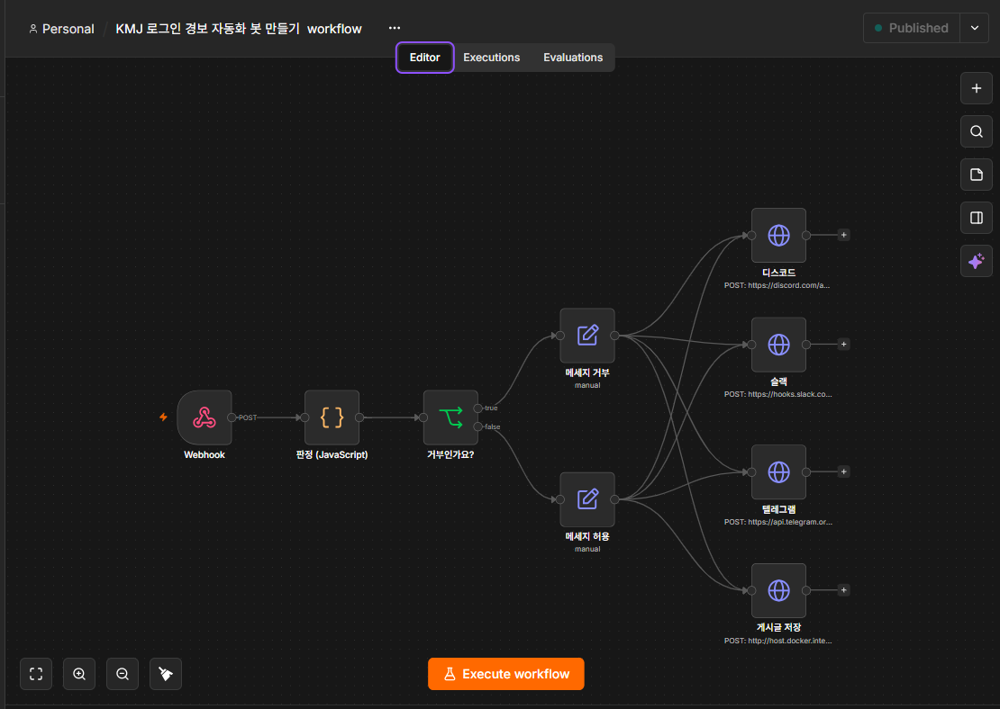

### 실행 성공 — 노드가 모두 초록

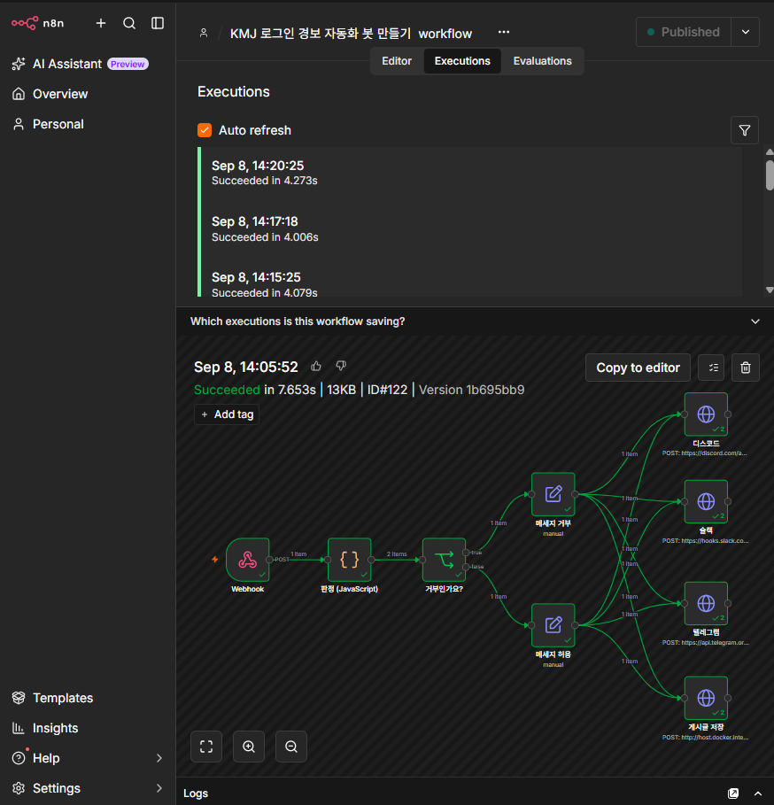

### Code 노드 출력 — 경보 2건이 아이템 2개로

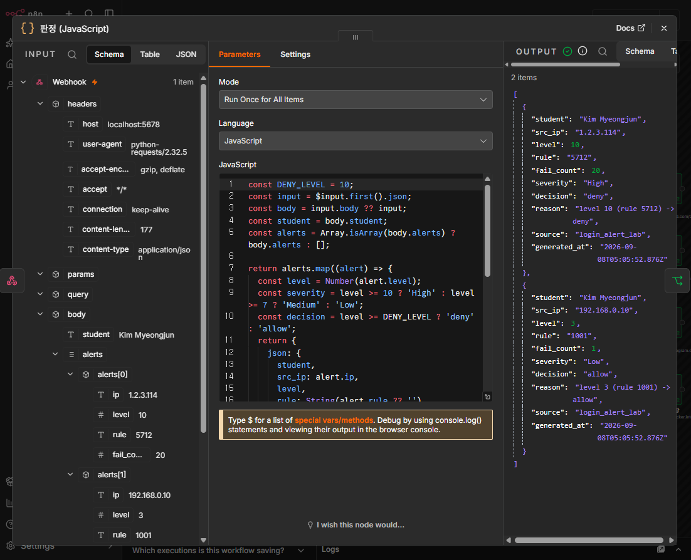

### 판정 기준을 바꾸면 결과가 뒤집힌다

`DENY_LEVEL`을 10에서 3으로 낮추면 같은 입력에서 `192.168.0.10`(level 3)이
`allow`에서 `deny`로 바뀝니다. 기준은 확인 후 10으로 되돌렸습니다.

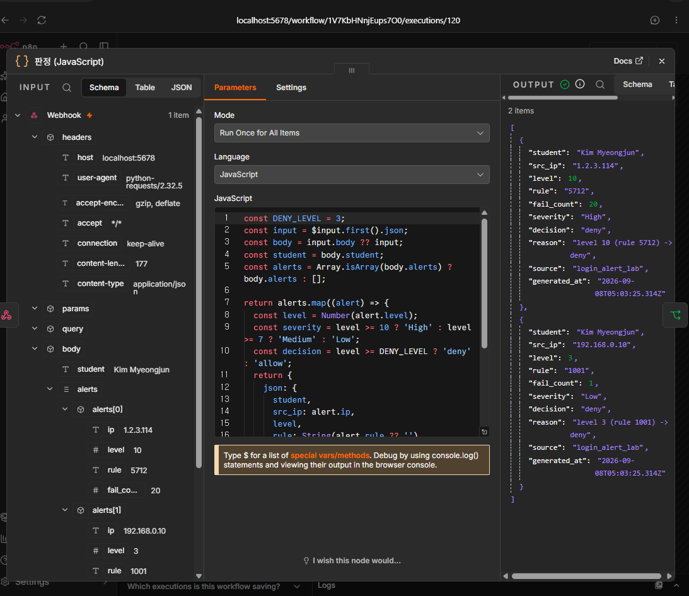

### 메신저 도착

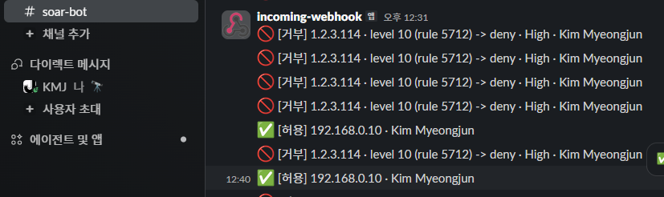
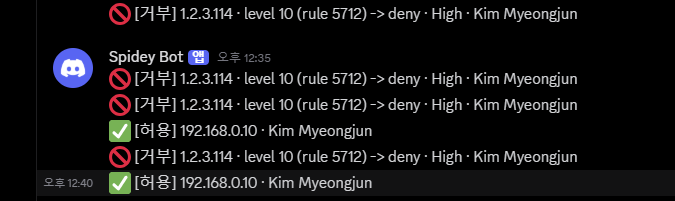
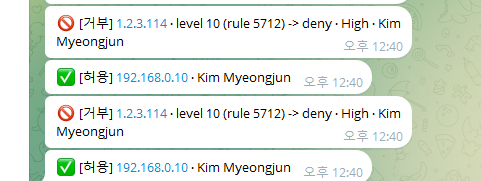

### 데이터베이스 저장 결과

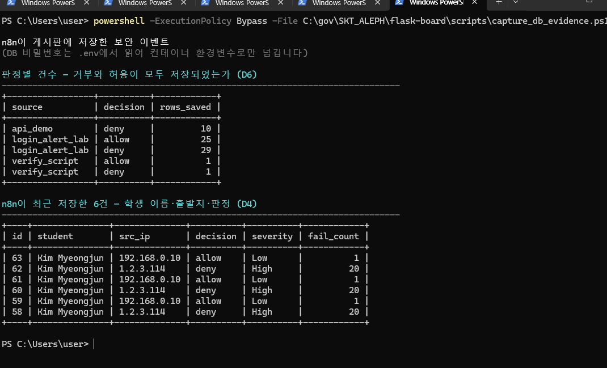

### 대시보드

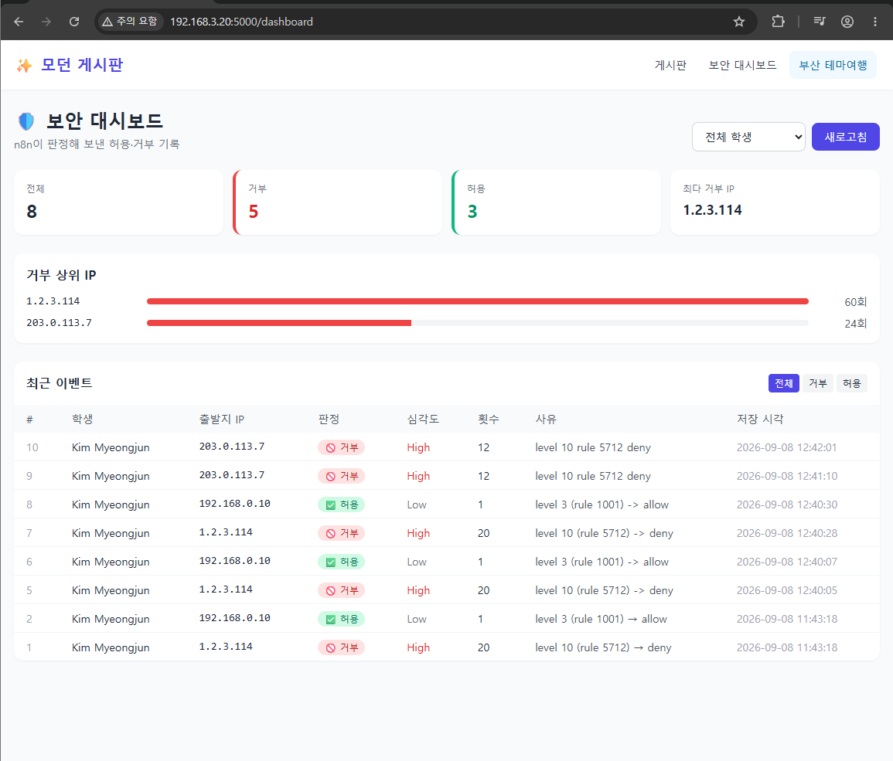

### 파이썬 전송기 실행

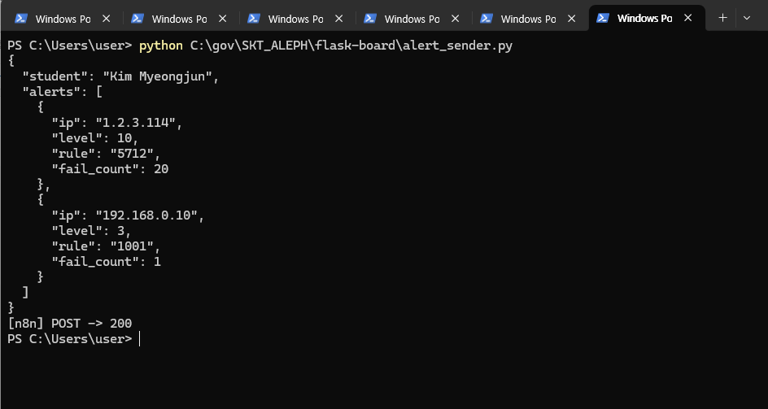

---

<details>
<summary>캡처 목록과 배점 대응 (제출 전 확인용 — 확정 후 지워도 됩니다)</summary>

| 파일명 | 무엇을 찍나 | 배점 항목 |
| --- | --- | --- |
| `01-n8n-workflow.png` | 노드가 연결된 캔버스 전체 | C1 |
| `02-n8n-execution.png` | IF 양쪽 갈래가 모두 초록인 실행 | C1 · D6 |
| `03-code-output.png` | Code 노드 OUTPUT — 아이템 2개, `decision`·`severity`·`reason` | B1 · B2 |
| `04-slack.png` | 슬랙에 🚫거부 + ✅허용 두 건 | C2 · C5 |
| `05-discord.png` | 디스코드에 두 건 | C3 |
| `06-telegram.png` | 텔레그램에 두 건 | C4 |
| `07-mysql.png` | `SELECT ... FROM security_events` — 본인 이름, deny·allow 각 1건 | D4 |
| `08-dashboard.png` | `/dashboard` 화면 | (가점) |
| `09-sender.png` | `alert_sender.py` 실행 → `200` | A1 · A2 |
| `10-deny-level-3.png` | `DENY_LEVEL`을 3으로 바꾼 뒤 판정이 달라진 화면 | B3 |
| `11-api-401-400-201.png` | 키 없이 401 · 필수값 누락 400 · 정상 201 | D1 · D2 · D3 |
| `12-get-events.png` | `GET /api/security/events?student=...` 응답 | D5 |

</details>

## ④ 실행 방법

### ① 켜는 것

```powershell
docker start n8n flask_mysql     # n8n(5678), MySQL(3306)
Copy-Item .env.example .env      # 처음 한 번만. 실제 값을 채운다
pip install -r requirements.txt
python app.py                    # 게시판 5000번
```

n8n 화면(`http://localhost:5678`)에서 워크플로를 **Published** 상태로 둡니다.

### ② 실행하는 것

```powershell
python alert_sender.py
```

### ③ 무엇이 보이면 통과인가

- 터미널에 `[n8n] POST -> 200`
- n8n Executions에서 **IF 양쪽 갈래가 모두 초록**, `게시판 저장` 노드 응답 `201`
- 메신저에 🚫거부 1건 + ✅허용 1건 도착
- `http://127.0.0.1:5000/dashboard`에 두 줄이 보임
- MySQL에서 `SELECT * FROM security_events`에 deny·allow 각 1건

### ④ 안 될 때 보는 곳

| 증상 | 볼 곳 |
| --- | --- |
| n8n이 404 | 워크플로가 Published 상태인가. 주소가 `webhook-test`인가 `webhook`인가 |
| Code 노드가 바로 실패 | 오류 문구를 그대로 읽는다. 언어 선택 문제일 수 있다 (⑤ 참고) |
| 판정 결과가 비어 있음 | Webhook이 받은 데이터가 `body` **아래**에 들어간다. OUTPUT 패널 확인 |
| 메신저에 `{{ }}`가 그대로 | 입력칸이 표현식 모드인지 확인 |
| 게시판 저장이 연결 거부 | 컨테이너 안에서 `localhost`는 컨테이너 자신이다 (⑤ 참고) |
| 게시판 저장이 401 | `X-API-Key` 헤더 이름과 값이 `.env`의 `SECURITY_API_KEY`와 같은가 |
| 게시판 저장이 400 | 앞 노드에서 `src_ip` 등 원본 필드가 사라지지 않았는가 |

## ⑤ 막혔던 점과 해결

### 1. n8n 컨테이너에서 게시판에 연결이 되지 않았다

**증상** — 게시판 저장 노드가 연결 거부로 실패했습니다.

**원인** — n8n은 Docker 컨테이너 안에서 돌고 게시판은 호스트(내 PC)에서 돕니다.
컨테이너 안에서 `localhost:5000`은 **컨테이너 자기 자신의 5000번**이라, 거기엔
아무것도 없습니다.

**해결** — HTTP Request 노드의 주소를
`http://host.docker.internal:5000/api/security/events`로 바꿨습니다.

### 2. DB에 한 줄도 쌓이지 않았다

**증상** — 테이블은 만들어졌는데 `SELECT COUNT(*)`가 계속 `0`이었습니다.

**원인** — 게시판 서버(5000번)가 꺼져 있었습니다. n8n은 저장 요청을 보냈지만 받을
쪽이 없었습니다. n8n 실행 기록만 보고 "저장했다"고 넘기면 놓치는 지점입니다.

**해결** — `python app.py`로 게시판을 먼저 띄운 뒤 다시 실행했고, `201`과 함께
`id`가 돌아오는 것을 확인했습니다. 이후 **DB를 직접 조회해서** 확인하는 것을
절차에 넣었습니다.

### 3. Code 노드 언어 선택 때문에 판정 단계가 실행되지 않았다

문제지 B4 배점 항목입니다.

- **무슨 일이 있었나:** Code 노드를 Python으로 선택했더니 실행 기록에
  `Python runner unavailable: Python 3 is missing from this system` 오류가 나면서
  판정 노드에서 즉시 중단되었습니다.
- **원인:** 현재 n8n 실행 환경에는 Code 노드의 Python 실행에 필요한 Python 3
  러너가 준비되어 있지 않았습니다. `$input`을 사용하는 작성 코드도 JavaScript
  방식이었습니다.
- **어떻게 해결했나:** 노드 언어를 JavaScript로 바꾸고 `Run Once for All Items`에서
  `alerts.map(...)`으로 경보 2건을 각각 하나의 아이템으로 반환했습니다. 최신 성공
  실행에서 노드명이 `판정 (JavaScript)`로 표시되고 2개 아이템이 출력되는 것을
  확인했습니다.

### 4. 게시판 저장 요청이 400으로 거절되었다

**증상** — 메신저에는 올바른 값이 도착했지만 게시판 저장 노드만 400이 났습니다.

**원인** — JSON 본문 전체를 표현식으로 만든 상태에서 각 값에도 `=`를 붙여
`decision`이 `deny`가 아니라 `=deny`라는 문자열로 전달되었습니다. 같은 이유로
`student`, `src_ip`, `fail_count` 앞에도 `=`가 붙었습니다.

**해결** — JSON 값마다 붙어 있던 `=` 접두사를 제거했습니다. 이후 한 번의 실행에서
deny와 allow 요청이 각각 201로 저장되는 것을 확인했습니다.

## AI 활용 구분

- **AI에게 맡긴 일:** 게시판 구조 분리와 보안 이벤트 API·테스트 초안, n8n 오류
  원인 분석, 증적 수집 스크립트와 제출 문서 초안을 도움받았습니다.
- **내가 직접 판단한 일:** 슬랙·디스코드·텔레그램을 실제 계정에 모두 연결하고,
  허용·거부 테스트 데이터를 직접 실행해 도착 화면과 대시보드를 확인했습니다.
  비밀값은 `.env`와 n8n 내부 설정에만 두고 제출 캡처에서는 가렸습니다.
- **AI 제안을 따르지 않은 일:** 메신저 일부를 `httpbin`으로 대체할 수 있었지만,
  실제 3종 연동을 확인하는 것이 과제 목표에 더 맞다고 판단해 대체하지 않았습니다.

## 보안

- DB 비밀번호·애플리케이션 API 키·n8n Webhook 주소는 **`.env`에서** 읽습니다.
  저장소에는 값이 없는 `.env.example`만 있습니다.
- 메신저 Webhook과 봇 토큰은 저장소 코드가 아니라 **로컬 n8n HTTP Request 노드**에
  설정했습니다. 게시판의 `X-API-Key`는 n8n Credential로 주입하며, 워크플로를
  Export할 때는 메신저 주소와 Credential 값을 반드시 `<REDACTED>`로 바꿉니다.
- 테스트 데이터는 과제에서 지정한 합성 IP(`1.2.3.114`, `192.168.0.10`)만 씁니다.
  실제 사람의 계정·이메일·전화번호를 쓰지 않습니다.
- 개발 중 사용한 localhost용 n8n 테스트 Webhook 경로는 폐기하고 현재 production
  Webhook을 사용합니다. 메신저 비밀 주소가 보이는 n8n 상세 화면은 증적에서 제외했습니다.

## 심화 (S1)

`GET /api/security/events/summary?student=<이름>`으로 허용·거부 건수와 거부가 많은
상위 IP를 함께 봅니다.

```json
{ "student": "...", "by_decision": {"allow": 1, "deny": 1},
  "top_deny_ips": [{"src_ip": "1.2.3.114", "fails": 20}] }
```

## 심화 (S4) — 작업 스케줄러로 5분마다 자동 실행

`alert_sender.py`를 사람이 부르지 않아도 5분마다 실행합니다.

```powershell
powershell -ExecutionPolicy Bypass -File scripts\register_alert_task.ps1
```

등록되는 작업은 `\SKT-ALEPH-TEMP\TEMP-alert-sender-5min-DELETE-AFTER-SUBMIT`
입니다. 제출이 끝나면 지워야 하는 임시 작업이라, 작업 스케줄러 목록에서
이름만으로 용도와 처분 시점이 읽히게 두었습니다.

파이썬을 스케줄러에 바로 걸면 세 가지가 깨집니다. 스케줄러는 시작 위치를
보장하지 않아 옆의 `.env`를 못 읽고, PATH가 로그인 셸과 달라 `python`이 안
잡히며, 콘솔이 cp949라 한글 오류 메시지에서 `UnicodeEncodeError`가 납니다.
`scripts/run_alert_sender.ps1`이 셋을 모두 처리한 뒤 파이썬을 부릅니다.

실행 기록입니다. n8n이 아직 안 켜져 있던 구간과 켜진 뒤의 구간이 한 파일에
같이 남았습니다.

```text
[2026-09-08 11:51:18] SEND_FAILED (exit=1)
[2026-09-08 12:01:35] SEND_FAILED (exit=1)
[2026-09-08 12:02:22] SEND_FAILED (exit=1)
[2026-09-08 12:06:01] OK (exit=0)
[2026-09-08 12:11:39] OK (exit=0)
[2026-09-08 12:16:40] OK (exit=0)
[2026-09-08 12:21:40] OK (exit=0)
[2026-09-08 12:26:39] OK (exit=0)
[2026-09-08 12:31:40] OK (exit=0)
```

이 한 파일이 두 가지를 동시에 보입니다. **S4** — 5분 간격으로 사람 손 없이
실행된다. **A3** — n8n에 못 보내도 프로그램이 죽지 않고 오류만 남기고
정상 종료한다.

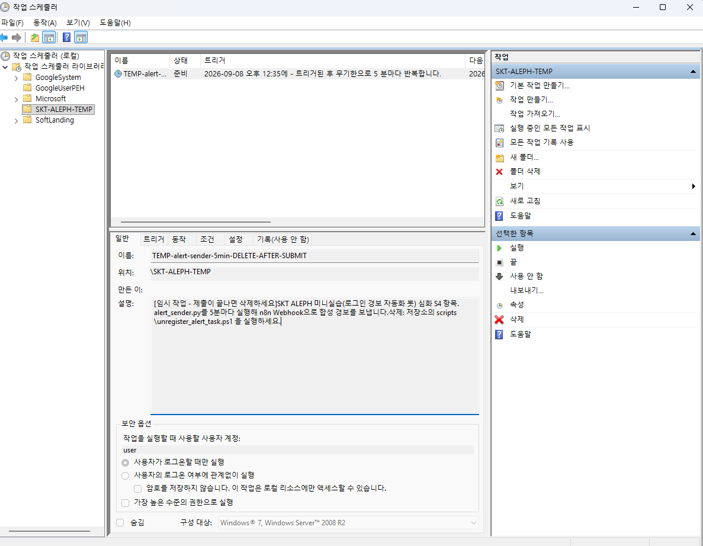
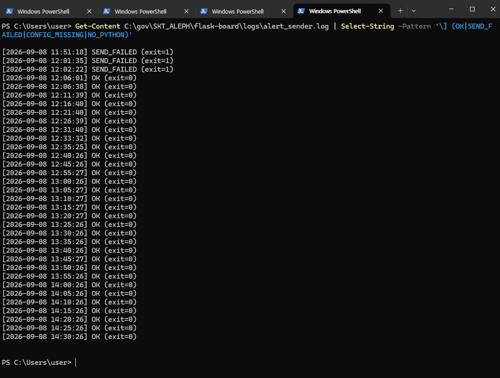

제출이 끝나면 반드시 지웁니다. 그대로 두면 5분마다 계속 요청이 갑니다.

```powershell
powershell -ExecutionPolicy Bypass -File scripts\unregister_alert_task.ps1
```
