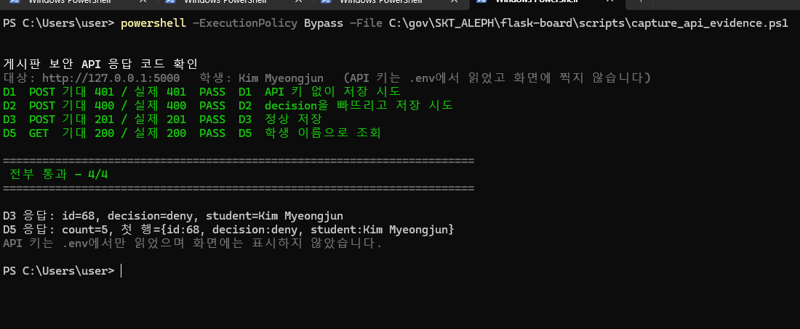

# [실습] 로그인 경보 자동화 봇 — 제출문

- **이름:** Kim Myeongjun (김명준)
- **사용한 n8n 버전 / Code 노드 언어:** n8n 2.37.9 (Docker) / **JavaScript**
  (Python으로 먼저 시도했다가 러너 부재로 실패 → B4 참고)
- **메신저 3종 중 실제로 연결한 것:** **슬랙 · 디스코드 · 텔레그램 3종 모두**
- **저장소:** https://github.com/myeongjundev/flask-board

---

## ① 무엇을 만들었는지

파이썬이 보낸 로그인 경보를 n8n이 스스로 판단(허용/거부)하고, 그 결과를 메신저로
알린 뒤 게시판 DB에 기록하는 자동화 봇입니다. 판단 기준은 Code 노드의 상수 하나로
모여 있어, 숫자만 바꾸면 허용이던 경보가 거부로 바뀝니다.

```text
[내 PC · 파이썬]              [Docker · n8n]                  [Docker · MySQL]
alert_sender.py                                                my_new_board_db
     │                                                               ▲
     │ ① HTTP POST (JSON)                                            │
     ▼                                                               │
  Webhook → Code(판정) → IF(deny?)                                    │
                          ├─ 🚫 거부 문구 ─┬─▶ 슬랙·디스코드·텔레그램   │
                          └─ ✅ 허용 문구 ─┘                          │
                                          └─▶ 게시판 저장 ── ③ REST ──┘
```

---

## ② 작업 내역

### 만든 순서

1. **게시판 정리** — 실습 파일 14개를 `config.py` · `models/` · `controllers/`로
   나누고, 설정값을 전부 `.env`로 뺐습니다.
2. **보안 이벤트 모델·API** — `security_events` 테이블과
   `POST/GET /api/security/events`를 만들었습니다. 저장은 `X-API-Key`로 막았습니다.
3. **파이썬 전송기** — `alert_sender.py`에서 거부될 경보(level 10)와 허용될
   경보(level 3)를 함께 보냅니다.
4. **n8n 워크플로** — Webhook → Code(판정) → IF(분기) → 메신저 3곳 + 게시판 저장.
5. **대시보드** — `/dashboard`에서 n8n이 저장한 허용·거부 결과를 확인합니다.

### 사용한 것

| 구분 | 사용 |
| --- | --- |
| 언어 | Python 3.13 |
| 웹 | Flask 3.1, Flask-SQLAlchemy, Flask-JWT-Extended |
| 자동화 | n8n 2.37.9 (Docker) — Webhook · Code(JavaScript) · IF · HTTP Request |
| DB | MySQL 8.0 (Docker), 스키마 `my_new_board_db` |
| 메신저 | 슬랙 · 디스코드 · 텔레그램 (3종 모두 실제 연결) |
| 기타 | python-dotenv, requests, pytest |

---

## ③ 기능 구현 화면

| 배점 항목 | 파일명 | 무엇이 보이나 |
| --- | --- | --- |
| C1 | `images/01-n8n-workflow.png` | 노드가 연결된 캔버스 전체 |
| C1 · D6 | `images/02-n8n-execution.png` | IF 양쪽 갈래가 모두 초록인 실행 |
| B1 · B2 | `images/03-code-output.png` | Code 노드 OUTPUT — 아이템 2개, `decision`·`severity`·`reason` |
| C2 · C5 | `images/04-slack.png` | 슬랙에 🚫거부 + ✅허용 |
| C3 · C5 | `images/05-discord.png` | 디스코드에 두 건 |
| C4 · C5 | `images/06-telegram.png` | 텔레그램에 두 건 |
| D4 · D6 | `images/07-mysql.png` | `security_events` 조회 — 본인 이름, deny·allow |
| S1 | `images/08-dashboard.png` | `/dashboard` 화면 |
| A1 · A2 | `images/09-sender.png` | `alert_sender.py` 실행 → `200` |
| B3 | `images/10-deny-level-3.png` | `DENY_LEVEL`을 3으로 바꾼 뒤 판정이 뒤집힌 화면 |
| D1 · D2 · D3 · D5 | `images/11-api-401-400-201.png` | 401 · 400 · 201 · 200 |
| S4 | `images/13-task-scheduler.png` | 작업 스케줄러에 5분 주기 트리거 |
| S4 · A3 | `images/14-task-log.png` | 5분 간격 `OK` 기록과 `SEND_FAILED` |

### n8n 워크플로 전체


### 실행 성공 — 노드가 모두 초록


### Code 노드 출력 — 경보 2건이 아이템 2개로


### 판정 기준을 바꾸면 결과가 뒤집힌다

`DENY_LEVEL`을 10에서 3으로 낮추면 같은 입력에서 `192.168.0.10`(level 3)이
`allow`에서 `deny`로 바뀝니다. 기준은 확인 후 10으로 되돌렸습니다.


### 메신저 도착


### 게시판 REST 응답 코드

키가 없으면 401, 필수값이 빠지면 400, 제대로 갖추면 201로 저장되고, 학생 이름으로
조회하면 200이 옵니다. `scripts/capture_api_evidence.ps1`이 넷을 순서대로 호출하고
기대값과 실제값을 나란히 찍습니다. API 키는 `.env`에서 읽어 헤더로만 넘기므로
화면에 남지 않습니다.



### 데이터베이스 저장 결과


### 대시보드


### 파이썬 전송기 실행


---

## ④ 실행 방법 — 실행 순서 4줄

**① 켜는 것:** Docker의 n8n(5678)·MySQL(3306)을 켜고, 워크플로를 **Published**로
둔 뒤, 게시판 `python app.py`(5000)를 띄운다.

**② 실행하는 것:** `python alert_sender.py`

**③ 통과 화면:** 터미널에 `[n8n] POST -> 200`, n8n Executions에서 IF **양쪽 갈래가
모두 초록**이고 `게시판 저장`이 `201`, 메신저 3곳에 🚫거부 1건 + ✅허용 1건,
`/dashboard`와 MySQL에 deny·allow 각 1건.

**④ 안 될 때 보는 곳:** n8n이 404면 Published 여부와 `webhook-test`/`webhook` 주소,
게시판 저장이 연결 거부면 `host.docker.internal`, 401이면 `X-API-Key`, 400이면 앞
노드에서 원본 필드가 사라졌는지.

<details>
<summary>자세한 명령과 증상별 대응표</summary>

### ① 켜는 것

```powershell
docker start n8n flask_mysql     # n8n(5678), MySQL(3306)
Copy-Item .env.example .env      # 처음 한 번만. 실제 값을 채운다
pip install -r requirements.txt
python app.py                    # 게시판 5000번
```

n8n 화면(`http://localhost:5678`)에서 워크플로를 **Published** 상태로 둡니다.

### ④ 안 될 때 보는 곳

| 증상 | 볼 곳 |
| --- | --- |
| n8n이 404 | 워크플로가 Published 상태인가. 주소가 `webhook-test`인가 `webhook`인가 |
| Code 노드가 바로 실패 | 오류 문구를 그대로 읽는다. 언어 선택 문제일 수 있다 (B4) |
| 판정 결과가 비어 있음 | Webhook이 받은 데이터가 `body` **아래**에 들어간다. OUTPUT 패널 확인 |
| 메신저에 `{{ }}`가 그대로 | 입력칸이 표현식 모드인지 확인 |
| 게시판 저장이 연결 거부 | 컨테이너 안에서 `localhost`는 컨테이너 자신이다 (막혔던 것 1) |
| 게시판 저장이 401 | `X-API-Key` 헤더 이름과 값이 `.env`의 `SECURITY_API_KEY`와 같은가 |
| 게시판 저장이 400 | 앞 노드에서 `src_ip` 등 원본 필드가 사라지지 않았는가 (막혔던 것 3) |

</details>

---

## ⑤ 막혔던 점과 해결

### 1. n8n 컨테이너에서 게시판에 연결이 되지 않았다

**증상** — 게시판 저장 노드가 연결 거부로 실패했습니다.

**원인** — n8n은 Docker 컨테이너 안에서 돌고 게시판은 호스트(내 PC)에서 돕니다.
컨테이너 안에서 `localhost:5000`은 **컨테이너 자기 자신의 5000번**이라, 거기엔
아무것도 없습니다.

**해결** — HTTP Request 노드의 주소를
`http://host.docker.internal:5000/api/security/events`로 바꿨습니다.

### 2. DB에 한 줄도 쌓이지 않았다

**증상** — 테이블은 만들어졌는데 `SELECT COUNT(*)`가 계속 `0`이었습니다.

**원인** — 게시판 서버(5000번)가 꺼져 있었습니다. n8n은 저장 요청을 보냈지만 받을
쪽이 없었습니다. n8n 실행 기록만 보고 "저장했다"고 넘기면 놓치는 지점입니다.

**해결** — `python app.py`로 게시판을 먼저 띄운 뒤 다시 실행했고, `201`과 함께
`id`가 돌아오는 것을 확인했습니다. 이후 **DB를 직접 조회해서** 확인하는 것을
절차에 넣었습니다.

### 3. 게시판 저장 요청이 400으로 거절되었다

**증상** — 메신저에는 올바른 값이 도착했는데 게시판 저장 노드만 400이 났습니다.
필드가 빠진 것처럼 보였지만 실제로는 다 들어 있었습니다.

**원인** — 게시판이 400을 낼 때 받은 본문을 그대로 로그에 남겨 보니 이랬습니다.

```text
{'student': '=Kim Myeongjun', 'src_ip': '=1.2.3.114', 'decision': '=deny', ...}
```

JSON 본문 전체를 표현식으로 둔 상태에서 각 값에도 `=`를 붙여, `decision`이 `deny`가
아니라 **`=deny`라는 문자열**로 전달되었습니다. `allow|deny` 검증에 걸린 것입니다.
`=`는 입력칸 전체를 표현식으로 만들 때 맨 앞에 한 번만 쓰는 기호입니다.

**해결** — JSON 값마다 붙어 있던 `=` 접두사를 지웠습니다. 이후 한 번의 실행에서
deny와 allow가 각각 201로 저장되는 것을 확인했습니다. 화면만 봐서는 못 찾았고,
**거절된 본문을 찍어보고 나서야** 원인이 드러났습니다.

---

## Code 노드 언어 함정 (B4)

- **무슨 일이 있었나:** Code 노드를 Python으로 선택했더니 실행 기록에
  `Python runner unavailable: Python 3 is missing from this system` 오류가 나면서
  판정 노드에서 즉시 중단되었습니다.
- **원인:** 이 n8n 실행 환경에는 Code 노드의 Python 실행에 필요한 Python 3 러너가
  준비되어 있지 않았습니다. 작성한 코드도 `$input`을 쓰는 JavaScript 방식이었습니다.
- **어떻게 해결했나:** 노드 언어를 JavaScript로 바꾸고 `Run Once for All Items`에서
  `alerts.map(...)`으로 경보 2건을 각각 하나의 아이템으로 반환했습니다. 최신 성공
  실행에서 노드명이 `판정 (JavaScript)`로 표시되고 2개 아이템이 출력되는 것을
  확인했습니다.

---

## AI 활용 구분

- **AI에게 맡긴 일:** 게시판 구조 분리와 보안 이벤트 API·테스트 초안, n8n 오류
  원인 분석, 증적 수집 스크립트와 제출 문서 초안을 도움받았습니다.
- **내가 직접 판단한 일:** 슬랙·디스코드·텔레그램을 실제 계정에 모두 연결하고,
  허용·거부 테스트 데이터를 직접 실행해 도착 화면과 대시보드를 확인했습니다.
  비밀값은 `.env`와 n8n 내부 설정에만 두고 제출 캡처에서는 가렸습니다.
- **AI 제안을 따르지 않은 일:** 메신저 일부를 `httpbin`으로 대체할 수 있었지만,
  실제 3종 연동을 확인하는 것이 과제 목표에 더 맞다고 판단해 대체하지 않았습니다.

---

## 제출 체크리스트 결과

증적 파일은 모두 `images/` 폴더에 있습니다.

### 과제 1 — 파이썬 전송기 (`alert_sender.py`)

| | 요구사항 | 증적 |
| --- | --- | --- |
| **[x]** | 보내는 JSON에 `student`가 들어간다 | `09-sender.png` |
| **[x]** | `alerts` 배열에 경보 2건, 각각 `ip`·`level`·`rule` | `09-sender.png` |
| **[x]** | 거부될 것(level 10)과 허용될 것(level 3)이 모두 포함 | `09-sender.png` |
| **[x]** | 전송 실패 시 죽지 않고 오류 메시지 출력 | `14-task-log.png` |
| **[x]** | n8n 주소·이름을 코드 맨 위 상수로 모음 | `alert_sender.py` 상단 |

### 과제 2 — n8n 판정 (Code 노드)

| | 요구사항 | 증적 |
| --- | --- | --- |
| **[x]** | 경보 2건을 보내면 아이템이 2개로 나온다 | `03-code-output.png` |
| **[x]** | `reason`에 판정 근거가 사람이 읽게 들어간다 | `03-code-output.png` |
| **[x]** | 거부 기준을 10 → 3으로 바꾸면 허용이 거부로 바뀐다 | `10-deny-level-3.png` |
| **[x]** | 출력 필드 8종을 모두 내보낸다 | `03-code-output.png` |
| **[x]** | Code 노드 언어 함정의 원인과 해결을 적었다 | 아래 B4 절 |

출력 필드: `student` · `src_ip` · `level` · `rule` · `fail_count` · `severity` ·
`decision` · `reason`

판정 규칙 — 거부 기준은 Code 노드 맨 위 `DENY_LEVEL` 상수 하나입니다.

| 조건 | severity | decision |
| --- | --- | --- |
| level >= 10 | High | **deny** |
| level >= 7 | Medium | allow |
| 그 외 | Low | allow |

### 과제 3 — 분기와 메시지 (IF + 두 갈래)

| | 요구사항 | 증적 |
| --- | --- | --- |
| **[x]** | IF 노드로 `deny`와 그 외를 두 갈래로 나눈다 | `01-n8n-workflow.png` |
| **[x]** | 거부 쪽은 🚫로 시작하고 `src_ip`·`reason`·`severity`·`student` 포함 | `04`·`05`·`06` |
| **[x]** | 허용 쪽은 ✅로 시작하는 더 짧은 문구 | `04`·`05`·`06` |
| **[x]** | 두 갈래 모두 슬랙·디스코드·텔레그램으로 나간다 | `02-n8n-execution.png` |
| **[x]** | 메신저 3곳에 채널당 거부 1건 + 허용 1건 도착 | `04`·`05`·`06` |

### 과제 4 — 게시판 REST + DB 저장

| | 요구사항 | 증적 |
| --- | --- | --- |
| **[x]** | `security_events` 테이블이 MySQL에 생긴다 | `07-mysql.png` |
| **[x]** | `X-API-Key` 없이 호출하면 401 | `11-api-401-400-201.png` |
| **[x]** | `X-API-Key`가 틀리면 401 | `tests/test_app.py` |
| **[x]** | `student`·`src_ip`·`decision`이 빠지면 400 | `11-api-401-400-201.png` |
| **[x]** | 정상 요청은 201이고 DB에 한 줄 쌓인다 | `11-api-401-400-201.png` · `07-mysql.png` |
| **[x]** | API 키를 소스코드에 직접 쓰지 않는다 | `.env`의 `SECURITY_API_KEY` |
| **[x]** | n8n 마지막 노드가 API를 호출해 거부·허용 둘 다 저장 | `07-mysql.png` |

### A. 파이썬 전송기

| | 항목 | 증적 |
| --- | --- | --- |
| **[x]** | A1 — 실행 화면에 n8n 응답 `200` | `09-sender.png` |
| **[x]** | A2 — 보낸 JSON에 `student`와 경보 2건 | `09-sender.png` |
| **[x]** | A3 — n8n을 끈 채 실행 → 죽지 않고 오류 출력 | `14-task-log.png` |

### B. n8n 판정

| | 항목 | 증적 |
| --- | --- | --- |
| **[x]** | B1 — Code 노드 OUTPUT에 아이템 2개 | `03-code-output.png` |
| **[x]** | B2 — level 10 → deny/High, level 3 → allow/Low | `03-code-output.png` |
| **[x]** | B3 — 거부 기준을 바꿔 판정이 달라지는 것을 2회 실행 비교 | `03` ↔ `10` |
| **[x]** | B4 — Code 노드 언어 함정의 원인과 해결을 적었다 | 아래 B4 절 |

### C. 분기와 메신저

| | 항목 | 증적 |
| --- | --- | --- |
| **[x]** | C1 — IF 두 갈래가 모두 초록으로 실행된 캔버스 | `02-n8n-execution.png` |
| **[x]** | C2 — 슬랙에 거부·허용 도착 | `04-slack.png` |
| **[x]** | C3 — 디스코드에 거부·허용 도착 | `05-discord.png` |
| **[x]** | C4 — 텔레그램에 거부·허용 도착 | `06-telegram.png` |
| **[x]** | C5 — 거부(🚫)와 허용(✅) 문구 형식이 다르다 | `04`·`05`·`06` |

### D. 게시판 REST + DB

| | 항목 | 증적 |
| --- | --- | --- |
| **[x]** | D1 — 키 없이 POST → 401 | `11-api-401-400-201.png` |
| **[x]** | D2 — 필수값 빠뜨리고 POST → 400 | `11-api-401-400-201.png` |
| **[x]** | D3 — 정상 POST → 201 + `id` 반환 | `11-api-401-400-201.png` |
| **[x]** | D4 — `security_events`에 본인 이름과 deny·allow 각 1건 이상 | `07-mysql.png` |
| **[x]** | D5 — `GET /api/security/events?student=<본인>` 응답 JSON | `11-api-401-400-201.png` |
| **[x]** | D6 — `게시판 저장` 노드가 초록이고 거부·허용 둘 다 저장 | `02-n8n-execution.png` · `07-mysql.png` |

### E. 안전 · 제출 무결성

| | 항목 | 증적 |
| --- | --- | --- |
| **[x]** | E1 — Webhook URL·봇 토큰·API 키가 소스·제출물·깃에 원문 0건 | 아래 「보안」 절 |
| **[x]** | E2 — 워크플로 Export는 제출물에 포함하지 않음 | — |
| **[x]** | E3 — 실행 순서 4줄 | 위 「실행 순서」 절 |
| **[x]** | E4 — AI 활용 3구분 | 아래 「AI 활용 구분」 절 |

E1은 제출 이미지 13장을 한 장씩 열어 비밀값이 보이지 않는 것까지 확인했습니다.
n8n 노드 부제에 나오는 주소는 모두 잘린 형태입니다.

### (선택) 심화 — 하나 이상 하면 가산점

| | 코드 | 내용 | 증적 |
| --- | --- | --- | --- |
| **[x]** | **S1** | `GET /api/security/events/summary?student=<이름>` — 허용/거부 건수와 거부 상위 IP | `08-dashboard.png` |
| [ ] | S2 | 허용은 슬랙 1곳, 거부는 3곳 전부 (분기별로 다르게) | 하지 않음 |
| [ ] | S3 | 디스코드를 `embeds` 카드로 — 거부 빨강 / 허용 초록 | 하지 않음 |
| **[x]** | **S4** | 윈도우 작업 스케줄러로 `alert_sender.py`를 5분마다 자동 실행 | `13-task-scheduler.png` · `14-task-log.png` |

가산점 상한이 **+6**이라 S1과 S4로 상한에 닿습니다. S2·S3는 그래서 하지
않았습니다. 두 항목의 적용 방법은 `docs/S2-S3-BRANCH-AND-EMBED.md`에 정리해
두었습니다.

---

## 보안

- DB 비밀번호·애플리케이션 API 키·n8n Webhook 주소는 **`.env`에서** 읽습니다.
  저장소에는 값이 없는 `.env.example`만 있습니다.
- 메신저 Webhook과 봇 토큰은 저장소 코드가 아니라 **로컬 n8n HTTP Request 노드**에
  설정했습니다. 게시판의 `X-API-Key`는 n8n Credential로 주입하며, 워크플로를
  Export할 때는 메신저 주소와 Credential 값을 반드시 `<REDACTED>`로 바꿉니다.
- 테스트 데이터는 과제에서 지정한 합성 IP(`1.2.3.114`, `192.168.0.10`)와 문서용
  예약 대역(`203.0.113.7`)만 씁니다. 실제 사람의 계정·이메일·전화번호를 쓰지
  않습니다.
- 개발 중 쓰던 localhost용 n8n 테스트 Webhook 경로는 폐기하고 현재 production
  Webhook을 사용합니다. 메신저 주소가 보이는 n8n 상세 화면은 증적에서 제외했습니다.
- `alert_sender.py`는 예외 메시지를 그대로 출력하지 않습니다. requests 예외에는
  실패한 URL(= Webhook 주소)이 실려 오기 때문이며, 테스트가 이를 검증합니다.

---

## 심화 (S1) — 학생별 요약 API

`GET /api/security/events/summary?student=<이름>`으로 허용·거부 건수와 거부가 많은
상위 IP를 함께 봅니다. `/dashboard`가 이 API를 씁니다.

```json
{ "student": "...", "by_decision": {"allow": 1, "deny": 1},
  "top_deny_ips": [{"src_ip": "1.2.3.114", "fails": 20}] }
```

## 심화 (S4) — 작업 스케줄러로 5분마다 자동 실행

`alert_sender.py`를 사람이 부르지 않아도 5분마다 실행합니다.

```powershell
powershell -ExecutionPolicy Bypass -File scripts\register_alert_task.ps1
```

등록되는 작업은 `\SKT-ALEPH-TEMP\TEMP-alert-sender-5min-DELETE-AFTER-SUBMIT`
입니다. 제출이 끝나면 지워야 하는 임시 작업이라, 작업 스케줄러 목록에서 이름만으로
용도와 처분 시점이 읽히게 두었습니다.

파이썬을 스케줄러에 바로 걸면 세 가지가 깨집니다. 스케줄러는 시작 위치를 보장하지
않아 옆의 `.env`를 못 읽고, PATH가 로그인 셸과 달라 `python`이 안 잡히며, 콘솔이
cp949라 한글 오류 메시지에서 `UnicodeEncodeError`가 납니다.
`scripts/run_alert_sender.ps1`이 셋을 모두 처리한 뒤 파이썬을 부릅니다.

실행 기록입니다. n8n이 아직 안 켜져 있던 구간과 켜진 뒤의 구간이 한 파일에 같이
남았습니다.

```text
[2026-09-08 11:51:18] SEND_FAILED (exit=1)
[2026-09-08 12:01:35] SEND_FAILED (exit=1)
[2026-09-08 12:02:22] SEND_FAILED (exit=1)
[2026-09-08 12:06:01] OK (exit=0)
[2026-09-08 12:11:39] OK (exit=0)
[2026-09-08 12:16:40] OK (exit=0)
        ...  14:30:26까지 5분 간격으로 이어짐
```

이 한 파일이 두 가지를 동시에 보입니다. **S4** — 5분 간격으로 사람 손 없이
실행된다. **A3** — n8n에 못 보내도 프로그램이 죽지 않고 오류만 남기고 정상
종료한다.


제출이 끝나면 반드시 지웁니다. 그대로 두면 5분마다 계속 요청이 갑니다.

```powershell
powershell -ExecutionPolicy Bypass -File scripts\unregister_alert_task.ps1
```

---

## 부록 — 저장소 안내

| 경로 | 내용 |
| --- | --- |
| `alert_sender.py` | 경보를 만들어 n8n으로 보내는 전송기 |
| `controllers/security_controller.py` | 보안 이벤트 REST API |
| `templates/dashboard.html` | 보안 대시보드 |
| `scripts/capture_api_evidence.ps1` | 401·400·201·200을 한 화면에 (증적용) |
| `scripts/capture_db_evidence.ps1` | 저장된 행과 판정별 건수 (증적용) |
| `scripts/*_alert_task.ps1` | 심화 S4 스케줄러 등록·해제 |
| `docs/SUBMISSION-CHECKLIST.md` | 항목별 확인 기록 |

두 캡처 스크립트는 API 키와 DB 비밀번호를 **화면에 찍지 않습니다.** `.env`에서 읽어
헤더와 컨테이너 환경변수로만 넘깁니다.

```powershell
python -m pytest -q        # 8 passed
```
