# Flask 보안 실습 게시판 — Graylog · n8n · Wazuh

Flask 게시판의 로그인·접근 제어·보안 이벤트를 Graylog와 Wazuh로 탐지하고,
n8n으로 알림과 계정 잠금·IP 차단·인시던트 대응을 연결하는 수업 실습 저장소입니다.
기존 로그인 경보 봇의 제출 기록과 이후 실습 결과를 함께 보관합니다.

**최근 확인: 2026-10-08.** Wazuh 4.9.0 Dashboard 연결과 Agent 경보 저장을
확인하고, 팀원별 LLM 검증 길라잡이와 Graylog Alerts 내보내기를 추가했습니다.

## 실행·검증 문서

| 목적 | 문서 |
| --- | --- |
| 게시판·DB·n8n 실행 준비 | [SETUP.md](SETUP.md) |
| Wazuh Manager·Indexer·Dashboard 구성과 기존 설정 보존 | [Wazuh 실행 안내](wazuh/README.md) |
| Dashboard에 메시지가 없을 때 개인별 LLM 점검 | [Wazuh LLM 검증 길라잡이](docs/WAZUH-LLM-VERIFICATION-GUIDE.md) |
| Graylog 탐지 정의 복사·LLM 비교·다른 PC로 가져오기 | [Graylog Alerts 내보내기](graylog/exports/README.md) |
| PC·폴더를 옮긴 뒤 재연결 | [환경 재배치](docs/RELOCATION-RUNBOOK.md) |

게시판을 실행하는 PC에서 사용하는 주소입니다. `localhost`는 각자의 PC를 뜻합니다.

| 화면 | 주소 |
| --- | --- |
| Flask 게시판 / 보안 대시보드 | `http://localhost:5000/` / `http://localhost:5000/dashboard` |
| Graylog | `http://localhost:9000/` |
| n8n | `http://localhost:5678/` |
| Wazuh Dashboard | `https://localhost/` |

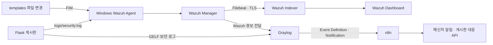
```mermaid
flowchart LR
  B[Flask 게시판] -->|GELF 보안 로그| G[Graylog]
  B -->|logs/security.log| A[Windows Wazuh Agent]
  T[templates 파일 변경] -->|FIM| A
  A --> M[Wazuh Manager]
  M -->|Filebeat · TLS| I[Wazuh Indexer]
  I --> D[Wazuh Dashboard]
  M -->|Wazuh 경보 전달| G
  G -->|Event Definition · Notification| N[n8n]
  N --> C[메신저 알림 · 게시판 대응 API]
```

## 10-08 Wazuh Dashboard 및 Graylog 설정 기록

### 구성과 검증 결과

Wazuh Manager·Indexer·Dashboard의 이미지를 **4.9.0**으로 맞추고,
Graylog와 같은 Docker 네트워크 **`9_graylog_default`**에 연결했습니다.
기존 Manager의 Agent 키·그룹·사용자 규칙·DB를 보존해 저장 볼륨으로 이전했습니다.
실제 인증서, Agent 등록 키와 개인 백업은 Git에 올리지 않습니다.

| 확인 항목 | 2026-10-08 결과 |
| --- | --- |
| Manager·Indexer·Dashboard | 컨테이너 실행 중, Dashboard 443 포트 |
| Agent | `001` / `board-host`, Active, `default, flask-board` 그룹 |
| Filebeat → Indexer | DNS·TLS 인증서 검증·서버 연결 통과 |
| Indexer 실제 저장 | 14:10 KST 점검에서 Agent 001 경보 107건. 수집에 따라 달라지는 관측값 |
| FIM | 무해한 파일 생성·수정 `100220`, 삭제 `100222` 경보 확인 후 테스트 파일 정리 |
| 기존 게시판 자동 테스트 | `unittest` 69개 통과 |

사용자 PC에서 확인한 Threat Hunting 화면에는 Windows 로그와 로그인 실패
`100210`, 반복 로그인 실패 의심 `100211` 경보가 표시됩니다. Graylog에서도 Wazuh
경보 메시지가 보이고, n8n 실행 목록에는 Wazuh 연동 워크플로의 성공 기록이 있습니다.
이 화면 기록과 별개로 각 팀원의 PC에서는 동일 이벤트가 각 구간을 통과하는지
검증해야 합니다. 메신저의 실제 전달 여부는 해당 실행을 따로 확인합니다.

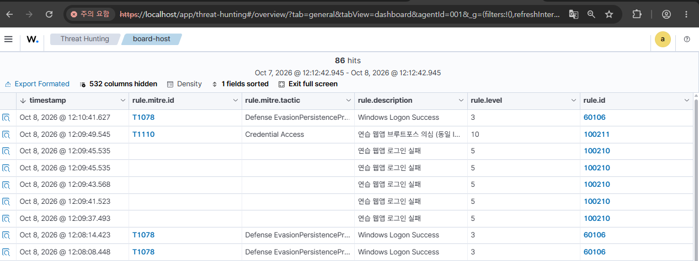

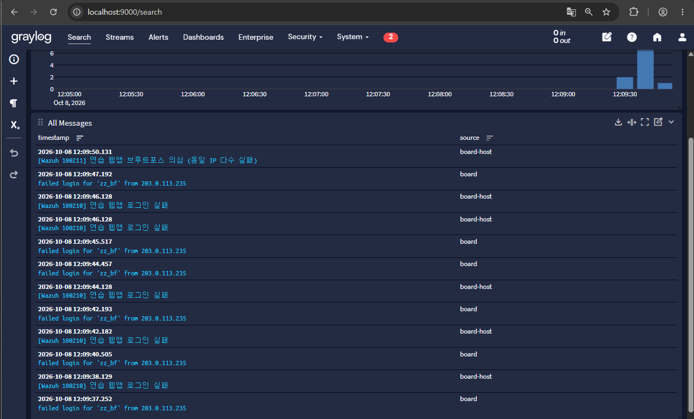

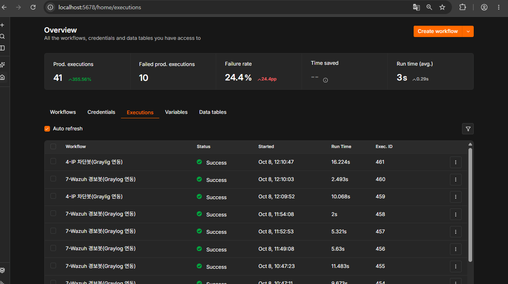

게시판 루트에서 현재 환경을 읽기 전용으로 점검합니다. 다른 PC에서는 실제 Agent ID를
먼저 확인하고 `001`을 자신의 ID로 바꿉니다.

```powershell
powershell -NoProfile -ExecutionPolicy Bypass -File .\scripts\check_wazuh.ps1 -AgentId 001
```

설정은 `config/`, Wazuh Compose는 `wazuh/docker-compose.yml`에 있습니다.
루트의 `docker-compose.yml`은 MySQL용이므로 Wazuh는 `-f wazuh/docker-compose.yml`로
실행합니다. 현재 Wazuh Compose의 외부 볼륨은 **기존 설정을 이전한 이 PC의 볼륨**입니다.
새 PC에서 실행하기 전에는 인증서 생성·기존 볼륨 복원 또는 새 볼륨 구성·Agent 등록과
자신의 게시판 경로 설정을 마쳐야 합니다. 자세한 순서는 [Wazuh 실행 안내](wazuh/README.md)를 따릅니다.

### 개인별 LLM 검토와 Graylog Alerts 복사

[LLM 검증 길라잡이](docs/WAZUH-LLM-VERIFICATION-GUIDE.md)는
게시판 파일 → Agent → Manager → Filebeat → Indexer → Dashboard를 단계별로 점검하고,
사실·추정·미확인 항목을 구분하게 합니다. 개인 경로와 Agent ID를 강사님 값으로
그대로 덮어쓰지 않도록 실제 값을 먼저 확인합니다.

실행 중인 Graylog 6.1.16 API에서 **Event Definitions 11개와 Notifications 6개**를
내보냈습니다. [설정 목록 MD](graylog/exports/20261008_124730/EVENT-DEFINITIONS.md)에는
검색식·집계·임계값·실행 간격·Custom Fields·연결 알림과 LLM 검토 요청문이 있습니다.
[Content Pack JSON](graylog/exports/20261008_124730/graylog-alerts.content-pack.json)은
시스템 기본 정의를 제외한 사용자 정의 10개와 연결 알림 6개를 담았습니다.

공유본의 URL·인증 정보는 제거하거나 입력 파라미터로 바꿨고, 가져온 정의는 비활성
상태에서 검토하도록 구성했습니다. 대상 PC의 n8n URL·인증·`Wazuh 경보` Stream을
확인한 뒤 활성화합니다. JSON 구문과 참조는 검증했으며 다른 PC에 설치하는 테스트는
실행하지 않았습니다. [가져오기 안내](graylog/exports/20261008_124730/README.md)를 따릅니다.

Dashboard 표에 Agent 이름을 표시하려면 위쪽의 **`columns hidden`**에서
`agent.name`을 표시하도록 선택합니다. 강사님 화면의 열 순서는
`timestamp → agent.name → rule.description → rule.level → rule.id`입니다.

---

## 최초 실습 — 로그인 경보 자동화 봇 제출 기록

- **이름:** Kim Myeongjun (김명준)
- **사용한 n8n 버전 / Code 노드 언어:** n8n 2.37.9 (Docker) / **JavaScript**
  (Python으로 먼저 시도했다가 러너 부재로 실패 → B4 참고)
- **메신저 3종 중 실제로 연결한 것:** **슬랙 · 디스코드 · 텔레그램 3종 모두**
- **저장소:** https://github.com/myeongjundev/flask-board

### 이 저장소에 담긴 실습

맨 처음 제출한 것은 ①~⑤의 로그인 경보 봇이고, 같은 게시판 위에 실습을 이어 붙였습니다.

| 날짜 | 실습 | 설명 위치 |
| --- | --- | --- |
| 09-04 ~ 09-08 | 로그인 경보 자동화 봇 — 파이썬 전송기 → n8n 판정 → 메신저 3종·게시판 저장 | 이 문서 ①~⑤, 심화 S1·S4 |
| 09-10 | 등급별 접근 제어 — 일반·골드·관리자, 자기 강등·자기 삭제·마지막 관리자 보호 | `docs/ROLE-ACCESS-CONTROL.md` |
| 09-17 | 과잉 관리자 권한 자동 회수 — 수업 코드 이식, Graylog 탐지 → n8n 회수 | 이 문서 "미니 실습 — 과잉 관리자 권한 자동 회수", `docs/PRIVILEGE-REVOKE-LAB.md` |
| 09-21 | SYN Flood 탐지 — Kali 2초 공격 → Graylog → n8n → 메신저 3종·게시판 | 이 문서 "미니 실습 — SYN Flood", `docs/MINI-LAB-SYN-FLOOD.md` |
| 09-28 | 강사님 연휴 업데이트 이식 — 인시던트 티켓 대시보드, 탐지 신호 4종(S5·S6·S9), SOAR 자기차단 수정 | 이 문서 "강사님 최신 보안 대응 코드 통합" |
| 10-06 | Gobuster·Nikto 웹 스캔 — 404 탐지 로그 연결 복구, Graylog 이벤트·차단 후 재시도 확인 | 이 문서 "10-06 Gobuster 404 스캔 탐지 연결 복구" |
| 10-08 | Wazuh 4.9.0 Dashboard·FIM 확인, 개인별 LLM 점검, Graylog Alerts 내보내기 | 이 문서 "10-08 Wazuh Dashboard 및 Graylog 설정 기록", `wazuh/README.md`, `graylog/exports/` |

자동 테스트는 69개이고 모두 통과합니다(실행 방법은 맨 아래 부록).

---

## ① 무엇을 만들었는지

파이썬이 보낸 로그인 경보를 n8n이 스스로 판단(허용/거부)하고, 그 결과를 메신저로
알린 뒤 게시판 DB에 기록하는 자동화 봇입니다. 판단 기준은 Code 노드의 상수 하나로
모여 있어, 숫자만 바꾸면 허용이던 경보가 거부로 바뀝니다.

```text
[내 PC · 파이썬]              [Docker · n8n]                  [Docker · MySQL]
alert_sender.py                                                my_new_board_db
     │                                                               ▲
     │ ① HTTP POST (JSON)                                            │
     ▼                                                               │
  Webhook → Code(판정) → IF(deny?)                                    │
                          ├─ 🚫 거부 문구 ─┬─▶ 슬랙·디스코드·텔레그램   │
                          └─ ✅ 허용 문구 ─┘                          │
                                          └─▶ 게시판 저장 ── ③ REST ──┘
```

---

## ② 작업 내역

### 만든 순서

1. **게시판 정리** — 실습 파일 14개를 `config.py` · `models/` · `controllers/`로
   나누고, 설정값을 전부 `.env`로 뺐습니다.
2. **보안 이벤트 모델·API** — `security_events` 테이블과
   `POST/GET /api/security/events`를 만들었습니다. 저장은 `X-API-Key`로 막았습니다.
3. **파이썬 전송기** — `alert_sender.py`에서 거부될 경보(level 10)와 허용될
   경보(level 3)를 함께 보냅니다.
4. **n8n 워크플로** — Webhook → Code(판정) → IF(분기) → 메신저 3곳 + 게시판 저장.
5. **대시보드** — `/dashboard`에서 n8n이 저장한 허용·거부 결과를 확인합니다.

### 사용한 것

| 구분 | 사용 |
| --- | --- |
| 언어 | Python 3.13 |
| 웹 | Flask 3.1, Flask-SQLAlchemy, Flask-JWT-Extended |
| 자동화 | n8n 2.37.9 (Docker) — Webhook · Code(JavaScript) · IF · HTTP Request |
| DB | MySQL 8.0 (Docker), 스키마 `my_new_board_db` |
| 메신저 | 슬랙 · 디스코드 · 텔레그램 (3종 모두 실제 연결) |
| 기타 | python-dotenv, requests, unittest |
| 로그·탐지 | Graylog 6.1.16, Wazuh 4.9.0 Manager·Indexer·Dashboard, Windows Wazuh Agent |

---

## ③ 기능 구현 화면

| 배점 항목 | 파일명 | 무엇이 보이나 |
| --- | --- | --- |
| C1 | `images/01-n8n-workflow.png` | 노드가 연결된 캔버스 전체 |
| C1 · D6 | `images/02-n8n-execution.png` | IF 양쪽 갈래가 모두 초록인 실행 |
| B1 · B2 | `images/03-code-output.png` | Code 노드 OUTPUT — 아이템 2개, `decision`·`severity`·`reason` |
| C2 · C5 | `images/04-slack.png` | 슬랙에 🚫거부 + ✅허용 |
| C3 · C5 | `images/05-discord.png` | 디스코드에 두 건 |
| C4 · C5 | `images/06-telegram.png` | 텔레그램에 두 건 |
| D4 · D6 | `images/07-mysql.png` | `security_events` 조회 — 본인 이름, deny·allow |
| S1 | `images/08-dashboard.png` | `/dashboard` 화면 |
| A1 · A2 | `images/09-sender.png` | `alert_sender.py` 실행 → `200` |
| B3 | `images/10-deny-level-3.png` | `DENY_LEVEL`을 3으로 바꾼 뒤 판정이 뒤집힌 화면 |
| D1 · D2 · D3 · D5 | `images/11-api-401-400-201.png` | 401 · 400 · 201 · 200 |
| S4 | `images/13-task-scheduler.png` | 작업 스케줄러에 5분 주기 트리거 |
| S4 · A3 | `images/14-task-log.png` | 5분 간격 `OK` 기록과 `SEND_FAILED` |

### n8n 워크플로 전체

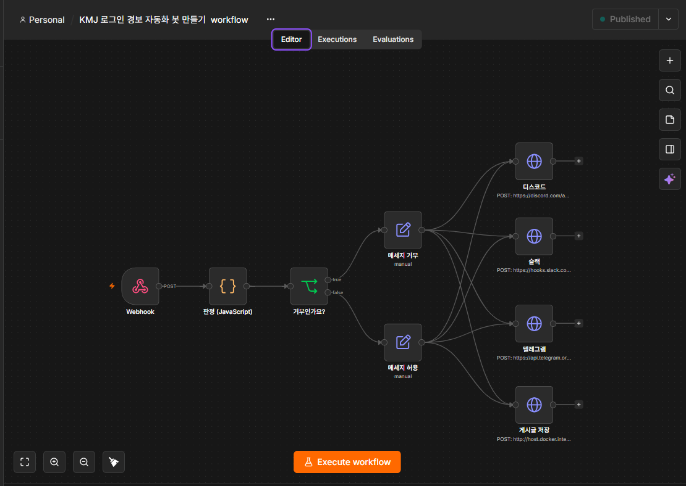

### 실행 성공 — 노드가 모두 초록

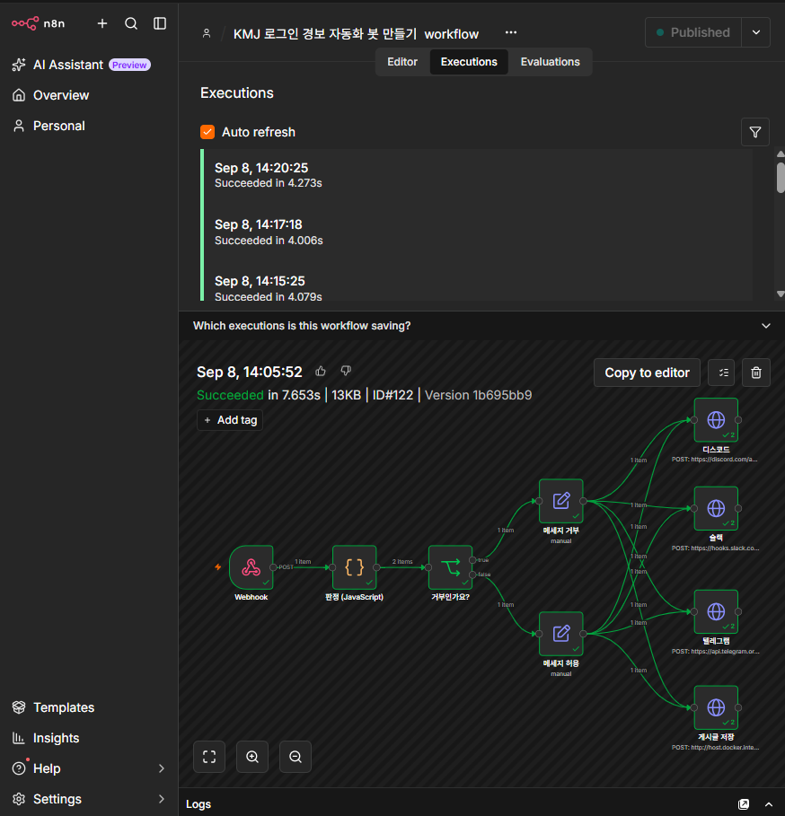

### Code 노드 출력 — 경보 2건이 아이템 2개로

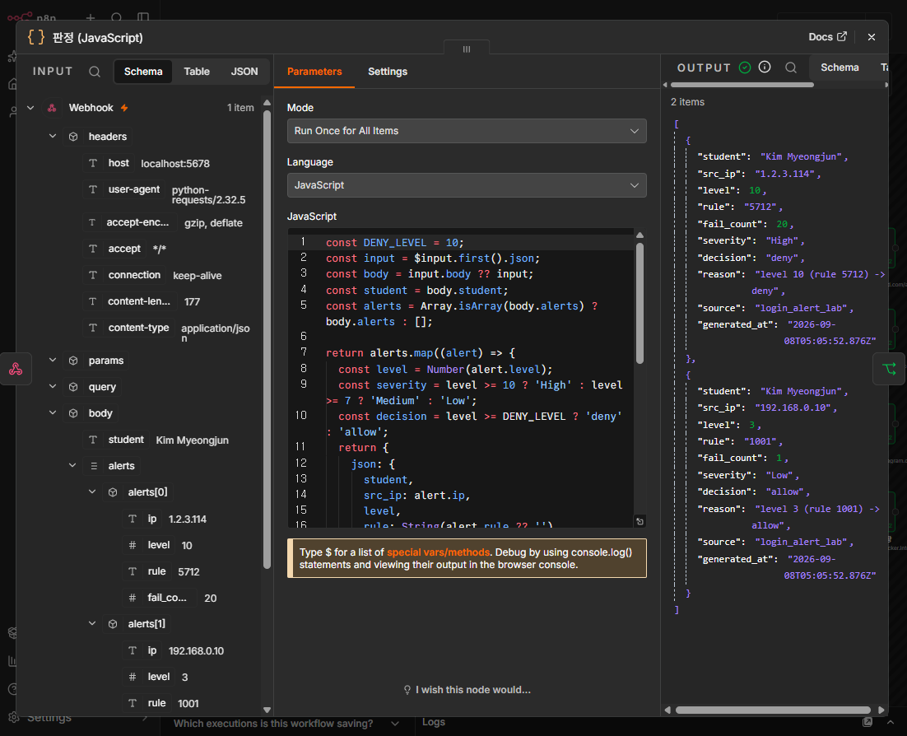

### 판정 기준을 바꾸면 결과가 뒤집힌다

`DENY_LEVEL`을 10에서 3으로 낮추면 같은 입력에서 `192.168.0.10`(level 3)이
`allow`에서 `deny`로 바뀝니다. 기준은 확인 후 10으로 되돌렸습니다.

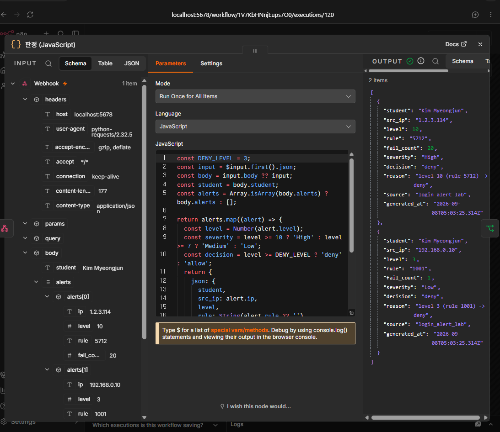

### 메신저 도착

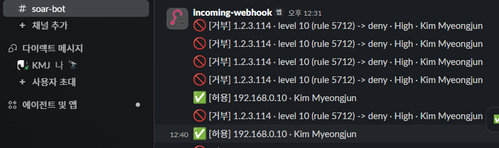
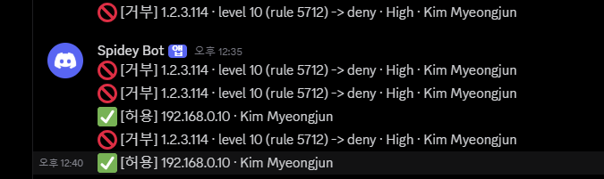
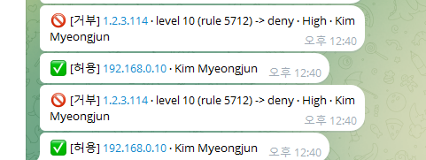

### 게시판 REST 응답 코드

키가 없으면 401, 필수값이 빠지면 400, 제대로 갖추면 201로 저장되고, 학생 이름으로
조회하면 200이 옵니다. `scripts/capture_api_evidence.ps1`이 넷을 순서대로 호출하고
기대값과 실제값을 나란히 찍습니다. API 키는 `.env`에서 읽어 헤더로만 넘기므로
화면에 남지 않습니다.

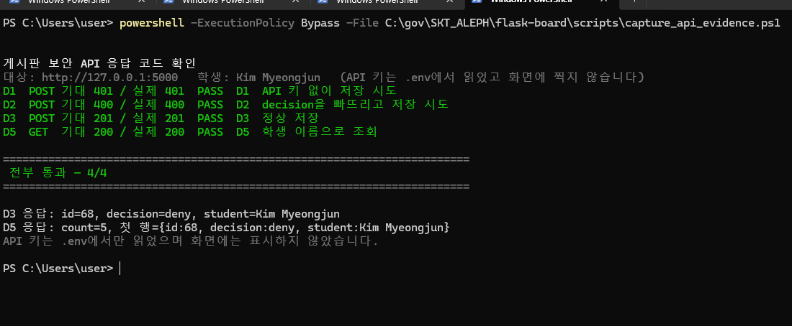

### 데이터베이스 저장 결과

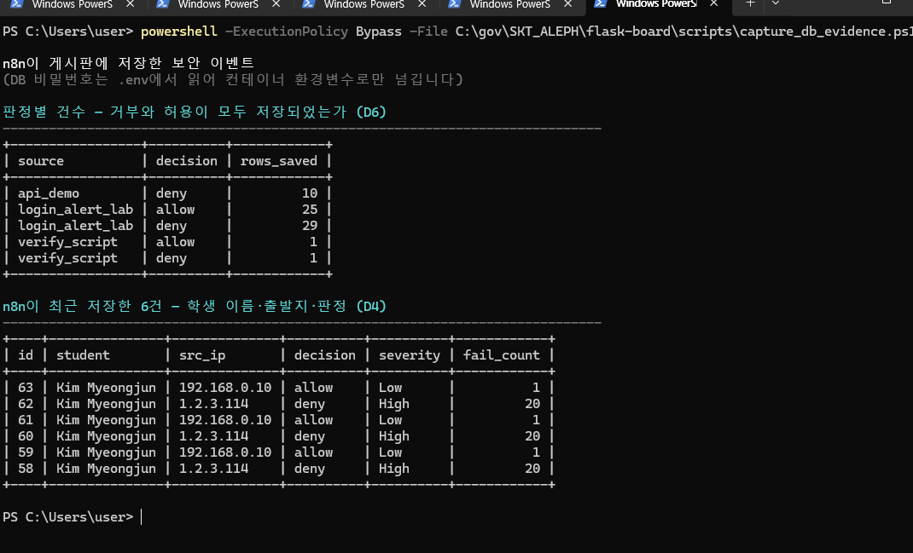

### 대시보드

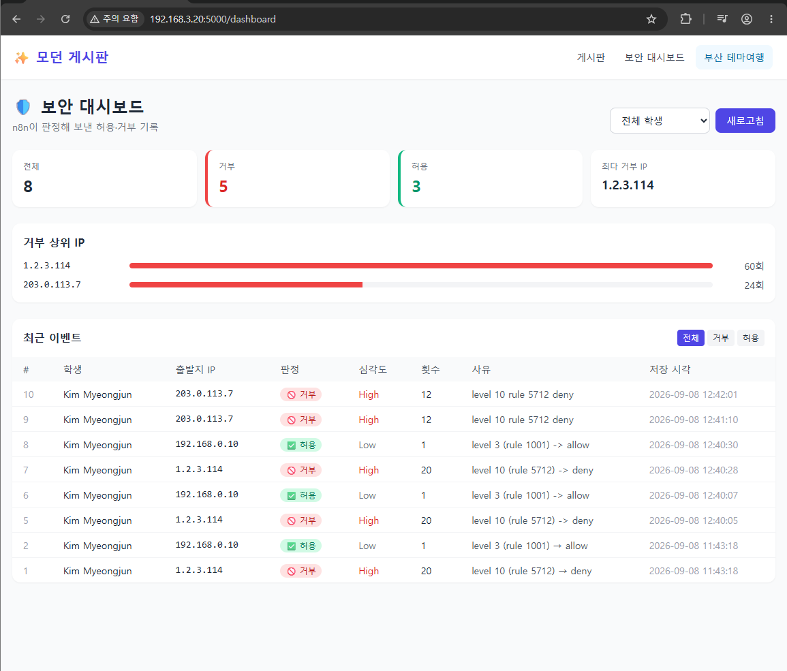

### 파이썬 전송기 실행

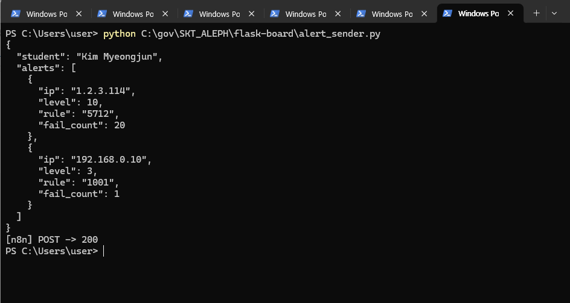

---

## ④ 실행 방법 — 실행 순서 4줄

**① 켜는 것:** Docker의 n8n(5678)·MySQL(3306)을 켜고, 워크플로를 **Published**로
둔 뒤, 게시판 `python app.py`(5000)를 띄운다.

**② 실행하는 것:** `python alert_sender.py`

**③ 통과 화면:** 터미널에 `[n8n] POST -> 200`, n8n Executions에서 IF **양쪽 갈래가
모두 초록**이고 `게시판 저장`이 `201`, 메신저 3곳에 🚫거부 1건 + ✅허용 1건,
`/dashboard`와 MySQL에 deny·allow 각 1건.

**④ 안 될 때 보는 곳:** n8n이 404면 Published 여부와 `webhook-test`/`webhook` 주소,
게시판 저장이 연결 거부면 `host.docker.internal`, 401이면 `X-API-Key`, 400이면 앞
노드에서 원본 필드가 사라졌는지.

<details>
<summary>자세한 명령과 증상별 대응표</summary>

### ① 켜는 것

```powershell
docker start n8n flask_mysql     # n8n(5678), MySQL(3306)
Copy-Item .env.example .env      # 처음 한 번만. 실제 값을 채운다
pip install -r requirements.txt
python app.py                    # 게시판 5000번
```

n8n 화면(`http://localhost:5678`)에서 워크플로를 **Published** 상태로 둡니다.

### ④ 안 될 때 보는 곳

| 증상 | 볼 곳 |
| --- | --- |
| n8n이 404 | 워크플로가 Published 상태인가. 주소가 `webhook-test`인가 `webhook`인가 |
| Code 노드가 바로 실패 | 오류 문구를 그대로 읽는다. 언어 선택 문제일 수 있다 (B4) |
| 판정 결과가 비어 있음 | Webhook이 받은 데이터가 `body` **아래**에 들어간다. OUTPUT 패널 확인 |
| 메신저에 `{{ }}`가 그대로 | 입력칸이 표현식 모드인지 확인 |
| 게시판 저장이 연결 거부 | 컨테이너 안에서 `localhost`는 컨테이너 자신이다 (막혔던 것 1) |
| 게시판 저장이 401 | `X-API-Key` 헤더 이름과 값이 `.env`의 `SECURITY_API_KEY`와 같은가 |
| 게시판 저장이 400 | 앞 노드에서 `src_ip` 등 원본 필드가 사라지지 않았는가 (막혔던 것 3) |

</details>

---

## ⑤ 막혔던 점과 해결

### 1. n8n 컨테이너에서 게시판에 연결이 되지 않았다

**증상** — 게시판 저장 노드가 연결 거부로 실패했습니다.

**원인** — n8n은 Docker 컨테이너 안에서 돌고 게시판은 호스트(내 PC)에서 돕니다.
컨테이너 안에서 `localhost:5000`은 **컨테이너 자기 자신의 5000번**이라, 거기엔
아무것도 없습니다.

**해결** — HTTP Request 노드의 주소를
`http://host.docker.internal:5000/api/security/events`로 바꿨습니다.

### 2. DB에 한 줄도 쌓이지 않았다

**증상** — 테이블은 만들어졌는데 `SELECT COUNT(*)`가 계속 `0`이었습니다.

**원인** — 게시판 서버(5000번)가 꺼져 있었습니다. n8n은 저장 요청을 보냈지만 받을
쪽이 없었습니다. n8n 실행 기록만 보고 "저장했다"고 넘기면 놓치는 지점입니다.

**해결** — `python app.py`로 게시판을 먼저 띄운 뒤 다시 실행했고, `201`과 함께
`id`가 돌아오는 것을 확인했습니다. 이후 **DB를 직접 조회해서** 확인하는 것을
절차에 넣었습니다.

### 3. 게시판 저장 요청이 400으로 거절되었다

**증상** — 메신저에는 올바른 값이 도착했는데 게시판 저장 노드만 400이 났습니다.
필드가 빠진 것처럼 보였지만 실제로는 다 들어 있었습니다.

**원인** — 게시판이 400을 낼 때 받은 본문을 그대로 로그에 남겨 보니 이랬습니다.

```text
{'student': '=Kim Myeongjun', 'src_ip': '=1.2.3.114', 'decision': '=deny', ...}
```

JSON 본문 전체를 표현식으로 둔 상태에서 각 값에도 `=`를 붙여, `decision`이 `deny`가
아니라 **`=deny`라는 문자열**로 전달되었습니다. `allow|deny` 검증에 걸린 것입니다.
`=`는 입력칸 전체를 표현식으로 만들 때 맨 앞에 한 번만 쓰는 기호입니다.

**해결** — JSON 값마다 붙어 있던 `=` 접두사를 지웠습니다. 이후 한 번의 실행에서
deny와 allow가 각각 201로 저장되는 것을 확인했습니다. 화면만 봐서는 못 찾았고,
**거절된 본문을 찍어보고 나서야** 원인이 드러났습니다.

---

## Code 노드 언어 함정 (B4)

- **무슨 일이 있었나:** Code 노드를 Python으로 선택했더니 실행 기록에
  `Python runner unavailable: Python 3 is missing from this system` 오류가 나면서
  판정 노드에서 즉시 중단되었습니다.
- **원인:** 이 n8n 실행 환경에는 Code 노드의 Python 실행에 필요한 Python 3 러너가
  준비되어 있지 않았습니다. 작성한 코드도 `$input`을 쓰는 JavaScript 방식이었습니다.
- **어떻게 해결했나:** 노드 언어를 JavaScript로 바꾸고 `Run Once for All Items`에서
  `alerts.map(...)`으로 경보 2건을 각각 하나의 아이템으로 반환했습니다. 최신 성공
  실행에서 노드명이 `판정 (JavaScript)`로 표시되고 2개 아이템이 출력되는 것을
  확인했습니다.

---

## AI 활용 구분

- **AI에게 맡긴 일:** 게시판 구조 분리와 보안 이벤트 API·테스트 초안, n8n 오류
  원인 분석, 증적 수집 스크립트와 제출 문서 초안을 도움받았습니다.
- **내가 직접 판단한 일:** 슬랙·디스코드·텔레그램을 실제 계정에 모두 연결하고,
  허용·거부 테스트 데이터를 직접 실행해 도착 화면과 대시보드를 확인했습니다.
  비밀값은 `.env`와 n8n 내부 설정에만 두고 제출 캡처에서는 가렸습니다.
- **AI 제안을 따르지 않은 일:** 메신저 일부를 `httpbin`으로 대체할 수 있었지만,
  실제 3종 연동을 확인하는 것이 과제 목표에 더 맞다고 판단해 대체하지 않았습니다.

---

## 제출 체크리스트 결과

증적 파일은 모두 `images/` 폴더에 있습니다.

### 과제 1 — 파이썬 전송기 (`alert_sender.py`)

| | 요구사항 | 증적 |
| --- | --- | --- |
| **[x]** | 보내는 JSON에 `student`가 들어간다 | `09-sender.png` |
| **[x]** | `alerts` 배열에 경보 2건, 각각 `ip`·`level`·`rule` | `09-sender.png` |
| **[x]** | 거부될 것(level 10)과 허용될 것(level 3)이 모두 포함 | `09-sender.png` |
| **[x]** | 전송 실패 시 죽지 않고 오류 메시지 출력 | `14-task-log.png` |
| **[x]** | n8n 주소·이름을 코드 맨 위 상수로 모음 | `alert_sender.py` 상단 |

### 과제 2 — n8n 판정 (Code 노드)

| | 요구사항 | 증적 |
| --- | --- | --- |
| **[x]** | 경보 2건을 보내면 아이템이 2개로 나온다 | `03-code-output.png` |
| **[x]** | `reason`에 판정 근거가 사람이 읽게 들어간다 | `03-code-output.png` |
| **[x]** | 거부 기준을 10 → 3으로 바꾸면 허용이 거부로 바뀐다 | `10-deny-level-3.png` |
| **[x]** | 출력 필드 8종을 모두 내보낸다 | `03-code-output.png` |
| **[x]** | Code 노드 언어 함정의 원인과 해결을 적었다 | 아래 B4 절 |

출력 필드: `student` · `src_ip` · `level` · `rule` · `fail_count` · `severity` ·
`decision` · `reason`

판정 규칙 — 거부 기준은 Code 노드 맨 위 `DENY_LEVEL` 상수 하나입니다.

| 조건 | severity | decision |
| --- | --- | --- |
| level >= 10 | High | **deny** |
| level >= 7 | Medium | allow |
| 그 외 | Low | allow |

### 과제 3 — 분기와 메시지 (IF + 두 갈래)

| | 요구사항 | 증적 |
| --- | --- | --- |
| **[x]** | IF 노드로 `deny`와 그 외를 두 갈래로 나눈다 | `01-n8n-workflow.png` |
| **[x]** | 거부 쪽은 🚫로 시작하고 `src_ip`·`reason`·`severity`·`student` 포함 | `04`·`05`·`06` |
| **[x]** | 허용 쪽은 ✅로 시작하는 더 짧은 문구 | `04`·`05`·`06` |
| **[x]** | 두 갈래 모두 슬랙·디스코드·텔레그램으로 나간다 | `02-n8n-execution.png` |
| **[x]** | 메신저 3곳에 채널당 거부 1건 + 허용 1건 도착 | `04`·`05`·`06` |

### 과제 4 — 게시판 REST + DB 저장

| | 요구사항 | 증적 |
| --- | --- | --- |
| **[x]** | `security_events` 테이블이 MySQL에 생긴다 | `07-mysql.png` |
| **[x]** | `X-API-Key` 없이 호출하면 401 | `11-api-401-400-201.png` |
| **[x]** | `X-API-Key`가 틀리면 401 | `tests/test_app.py` |
| **[x]** | `student`·`src_ip`·`decision`이 빠지면 400 | `11-api-401-400-201.png` |
| **[x]** | 정상 요청은 201이고 DB에 한 줄 쌓인다 | `11-api-401-400-201.png` · `07-mysql.png` |
| **[x]** | API 키를 소스코드에 직접 쓰지 않는다 | `.env`의 `SECURITY_API_KEY` |
| **[x]** | n8n 마지막 노드가 API를 호출해 거부·허용 둘 다 저장 | `07-mysql.png` |

### A. 파이썬 전송기

| | 항목 | 증적 |
| --- | --- | --- |
| **[x]** | A1 — 실행 화면에 n8n 응답 `200` | `09-sender.png` |
| **[x]** | A2 — 보낸 JSON에 `student`와 경보 2건 | `09-sender.png` |
| **[x]** | A3 — n8n을 끈 채 실행 → 죽지 않고 오류 출력 | `14-task-log.png` |

### B. n8n 판정

| | 항목 | 증적 |
| --- | --- | --- |
| **[x]** | B1 — Code 노드 OUTPUT에 아이템 2개 | `03-code-output.png` |
| **[x]** | B2 — level 10 → deny/High, level 3 → allow/Low | `03-code-output.png` |
| **[x]** | B3 — 거부 기준을 바꿔 판정이 달라지는 것을 2회 실행 비교 | `03` ↔ `10` |
| **[x]** | B4 — Code 노드 언어 함정의 원인과 해결을 적었다 | 아래 B4 절 |

### C. 분기와 메신저

| | 항목 | 증적 |
| --- | --- | --- |
| **[x]** | C1 — IF 두 갈래가 모두 초록으로 실행된 캔버스 | `02-n8n-execution.png` |
| **[x]** | C2 — 슬랙에 거부·허용 도착 | `04-slack.png` |
| **[x]** | C3 — 디스코드에 거부·허용 도착 | `05-discord.png` |
| **[x]** | C4 — 텔레그램에 거부·허용 도착 | `06-telegram.png` |
| **[x]** | C5 — 거부(🚫)와 허용(✅) 문구 형식이 다르다 | `04`·`05`·`06` |

### D. 게시판 REST + DB

| | 항목 | 증적 |
| --- | --- | --- |
| **[x]** | D1 — 키 없이 POST → 401 | `11-api-401-400-201.png` |
| **[x]** | D2 — 필수값 빠뜨리고 POST → 400 | `11-api-401-400-201.png` |
| **[x]** | D3 — 정상 POST → 201 + `id` 반환 | `11-api-401-400-201.png` |
| **[x]** | D4 — `security_events`에 본인 이름과 deny·allow 각 1건 이상 | `07-mysql.png` |
| **[x]** | D5 — `GET /api/security/events?student=<본인>` 응답 JSON | `11-api-401-400-201.png` |
| **[x]** | D6 — `게시판 저장` 노드가 초록이고 거부·허용 둘 다 저장 | `02-n8n-execution.png` · `07-mysql.png` |

### E. 안전 · 제출 무결성

| | 항목 | 증적 |
| --- | --- | --- |
| **[x]** | E1 — Webhook URL·봇 토큰·API 키가 소스·제출물·깃에 원문 0건 | 아래 「보안」 절 |
| **[x]** | E2 — 워크플로 Export는 제출물에 포함하지 않음 | — |
| **[x]** | E3 — 실행 순서 4줄 | 위 「실행 순서」 절 |
| **[x]** | E4 — AI 활용 3구분 | 아래 「AI 활용 구분」 절 |

E1은 제출 이미지 13장을 한 장씩 열어 비밀값이 보이지 않는 것까지 확인했습니다.
n8n 노드 부제에 나오는 주소는 모두 잘린 형태입니다.

### (선택) 심화 — 하나 이상 하면 가산점

| | 코드 | 내용 | 증적 |
| --- | --- | --- | --- |
| **[x]** | **S1** | `GET /api/security/events/summary?student=<이름>` — 허용/거부 건수와 거부 상위 IP | `08-dashboard.png` |
| [ ] | S2 | 허용은 슬랙 1곳, 거부는 3곳 전부 (분기별로 다르게) | 하지 않음 |
| [ ] | S3 | 디스코드를 `embeds` 카드로 — 거부 빨강 / 허용 초록 | 하지 않음 |
| **[x]** | **S4** | 윈도우 작업 스케줄러로 `alert_sender.py`를 5분마다 자동 실행 | `13-task-scheduler.png` · `14-task-log.png` |

가산점 상한이 **+6**이라 S1과 S4로 상한에 닿습니다. S2·S3는 그래서 하지
않았습니다. 두 항목의 적용 방법은 `docs/S2-S3-BRANCH-AND-EMBED.md`에 정리해
두었습니다.

---

## 보안

- DB 비밀번호·애플리케이션 API 키·n8n Webhook 주소는 **`.env`에서** 읽습니다.
  저장소에는 값이 없는 `.env.example`만 있습니다.
- 메신저 Webhook과 봇 토큰은 저장소 코드가 아니라 **로컬 n8n HTTP Request 노드**에
  설정했습니다. 게시판의 `X-API-Key`는 n8n Credential로 주입하며, 워크플로를
  Export할 때는 메신저 주소와 Credential 값을 반드시 `<REDACTED>`로 바꿉니다.
- 테스트 데이터는 과제에서 지정한 합성 IP(`1.2.3.114`, `192.168.0.10`)와 문서용
  예약 대역(`203.0.113.7`)만 씁니다. 실제 사람의 계정·이메일·전화번호를 쓰지
  않습니다.
- 개발 중 쓰던 localhost용 n8n 테스트 Webhook 경로는 폐기하고 현재 production
  Webhook을 사용합니다. 메신저 주소가 보이는 n8n 상세 화면은 증적에서 제외했습니다.
- `alert_sender.py`는 예외 메시지를 그대로 출력하지 않습니다. requests 예외에는
  실패한 URL(= Webhook 주소)이 실려 오기 때문이며, 테스트가 이를 검증합니다.

---

## 심화 (S1) — 학생별 요약 API

`GET /api/security/events/summary?student=<이름>`으로 허용·거부 건수와 거부가 많은
상위 IP를 함께 봅니다. `/dashboard`가 이 API를 씁니다.

```json
{ "student": "...", "by_decision": {"allow": 1, "deny": 1},
  "top_deny_ips": [{"src_ip": "1.2.3.114", "fails": 20}] }
```

## 심화 (S4) — 작업 스케줄러로 5분마다 자동 실행

`alert_sender.py`를 사람이 부르지 않아도 5분마다 실행합니다.

```powershell
powershell -ExecutionPolicy Bypass -File scripts\register_alert_task.ps1
```

등록되는 작업은 `\SKT-ALEPH-TEMP\TEMP-alert-sender-5min-DELETE-AFTER-SUBMIT`
입니다. 제출이 끝나면 지워야 하는 임시 작업이라, 작업 스케줄러 목록에서 이름만으로
용도와 처분 시점이 읽히게 두었습니다.

파이썬을 스케줄러에 바로 걸면 세 가지가 깨집니다. 스케줄러는 시작 위치를 보장하지
않아 옆의 `.env`를 못 읽고, PATH가 로그인 셸과 달라 `python`이 안 잡히며, 콘솔이
cp949라 한글 오류 메시지에서 `UnicodeEncodeError`가 납니다.
`scripts/run_alert_sender.ps1`이 셋을 모두 처리한 뒤 파이썬을 부릅니다.

실행 기록입니다. n8n이 아직 안 켜져 있던 구간과 켜진 뒤의 구간이 한 파일에 같이
남았습니다.

```text
[2026-09-08 11:51:18] SEND_FAILED (exit=1)
[2026-09-08 12:01:35] SEND_FAILED (exit=1)
[2026-09-08 12:02:22] SEND_FAILED (exit=1)
[2026-09-08 12:06:01] OK (exit=0)
[2026-09-08 12:11:39] OK (exit=0)
[2026-09-08 12:16:40] OK (exit=0)
        ...  14:30:26까지 5분 간격으로 이어짐
```

이 한 파일이 두 가지를 동시에 보입니다. **S4** — 5분 간격으로 사람 손 없이
실행된다. **A3** — n8n에 못 보내도 프로그램이 죽지 않고 오류만 남기고 정상
종료한다.

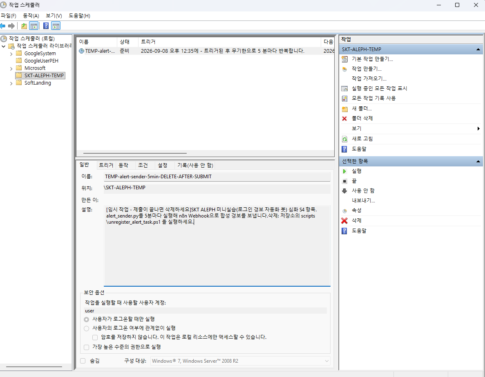
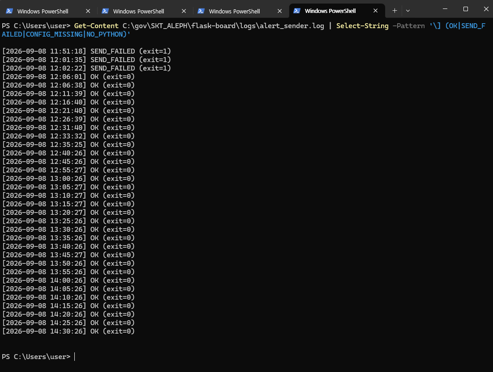

제출이 끝나면 반드시 지웁니다. 그대로 두면 5분마다 계속 요청이 갑니다.

```powershell
powershell -ExecutionPolicy Bypass -File scripts\unregister_alert_task.ps1
```

---

## 미니 실습 — 과잉 관리자 권한 자동 회수 (2026-09-17)

허용목록에 없는 관리자 계정을 탐지해 Graylog로 신고하고, Graylog Event
Notification이 n8n을 호출하면 게시판 API가 해당 계정의 권한을 자동 회수하는
전 구간(E2E) 실습입니다. 회수 결과는 보안 이벤트로 기록하고 Discord · Slack ·
Telegram에 동시에 알렸습니다.

```text
[권한 회수 봇/스케줄러]       [Graylog]              [n8n]
허용목록 밖 관리자 탐지 ──▶ rule:priv-unauthorized-admin ──▶ /webhook/priv-guard
                                                               │
                           ┌───────────────────────────────────┤
                           ▼                                   ▼
                 Flask 관리자 회수 API                 메신저 3종 알림
                    admin(2) → 일반(0)                         │
                           │                                   │
                           └────▶ 보안 이벤트 감사 기록 ◀──────┘
```

### 결과 요약

| 확인 지점 | 결과 |
| --- | --- |
| 관리자 화면 | 회원 등급과 허용목록 밖 관리자 상태 확인 |
| Graylog | `rule:priv-unauthorized-admin` 이벤트 정의와 n8n 알림 연결 |
| n8n | 탐지·회수·판정·메신저·게시판 저장 토폴로지 구성 |
| 직접 API 검증 | `zz_admin2`를 관리자(2)에서 일반(0)로 회수, HTTP 200 |
| E2E 검증 | `zz_victim`에게 관리자 권한 부여 후 다음 탐지 주기에 자동 회수 |
| 감사 기록 | `decision: deny`, `severity: High`, `source: privilege-guard` 저장 |
| 알림 | 작업 스케줄러 실행 결과가 Discord · Slack · Telegram에 도착 |

### 1. 게시판 관리자 화면과 보안 대시보드

관리자 화면에서 회원 등급과 허용목록을 관리하고, 보안 대시보드에서 자동 권한 회수
건수와 `권한 회수` 출처 이벤트를 확인했습니다.


### 2. Graylog 이벤트 정의와 n8n 알림

Graylog가 `rule:priv-unauthorized-admin`을 1분 범위로 검색하고, 일치한 이벤트의
`user`, `src_ip`, `granted_by` 필드를 n8n의 `priv-guard` Webhook으로 전달하도록
구성했습니다.


### 3. n8n 자동 회수 토폴로지

Webhook 수신 후 판정과 분기를 거쳐 게시판의 권한 회수 API를 호출하고, 결과를
메신저 3종과 게시판 감사 기록으로 보내는 흐름입니다.


### 4. 작업 스케줄러와 3채널 알림

Windows 작업 스케줄러가 권한 회수 봇을 5분마다 실행하며, 회수 결과가 Telegram,
Discord, Slack에 모두 도착하는 것을 확인했습니다.


### 5. 회수 API 직접 검증

먼저 `POST /api/admin/revoke`를 직접 호출해 `zz_admin2`의 역할이 관리자(2)에서
일반(0)으로 변경되고 회수 이벤트 ID가 반환되는 것을 확인했습니다.


### 6. 봇 신고의 Graylog 수집 확인

Graylog Search API에서 `rule:priv-unauthorized-admin` 메시지와 학생 식별자 등 신고
필드가 수집된 것을 확인했습니다.


### 7. 전 구간 E2E 자동 회수 검증

테스트 계정 `zz_victim`에 관리자 권한을 부여한 다음 탐지 주기를 기다리고, 관리자
목록과 보안 이벤트를 다시 조회했습니다. 자동 회수 후 감사 기록에는 `deny`, `High`,
`privilege-guard`와 회수 사유가 남았습니다.

 자동 회수-1-관리자 권한 부여.png>)

 자동 회수-2-60초 후 관리자 목록 조회.png>)

 자동 회수-3-감사 기록 확인.png>)

### 8. n8n 수신기 단독 확인

`POST /webhook/priv-guard`에 테스트 이벤트를 직접 보내 HTTP 200과
`Workflow was started` 응답을 확인했습니다.

.png>)

관련 실행·점검 절차는 `docs/PRIVILEGE-REVOKE-LAB.md`에 정리했습니다.

---

## 미니 실습 — SYN Flood 탐지부터 알림·저장까지 (2026-09-21)

Kali(WSL)에서 로컬 게시판을 대상으로 2초짜리 SYN Flood를 보내고, Graylog가 탐지한
결과가 n8n을 거쳐 메신저 3종과 게시판 대시보드까지 전달되는지 확인했습니다. 3초 수집
창의 SYN 개수가 임계값 1,000을 넘을 때만 GELF 경보를 보냅니다. 허가된 로컬 실습망에서만
실행합니다.

```text
[Kali/WSL]                   [Graylog]                         [n8n]
hping3 2초 + tcpdump 3초  →  GELF UDP 12201               →  판정 → 거부 분기
SYN 개수·출발지·학생을       rule:hping3-synflood 이벤트        ├─▶ Discord
GELF 필드로 전송             src_ip·syn_count·student 추출       ├─▶ Slack
                             5분 안의 재경보는 억제              ├─▶ Telegram
                                                                └─▶ Flask REST API → MySQL → /dashboard
```

### 결과 요약 (최종 실행 14:36)

| 확인 지점 | 결과 |
| --- | --- |
| 공격 발생기 | 3초 창에서 SYN **35,033개**, 임계값 1,000 초과 |
| Graylog | 메시지 필드 `src_ip 172.22.205.113` · `syn_count 35033` · `student myeongjundev` |
| n8n | 실행 ID 185, 워크플로 판 `e011de72`, **거부** 분기 |
| 메신저 3종 | `🚫 [거부] 172.22.205.113 — SYN 35,033개 탐지 · hping3-synflood → deny · 심각도 High (학생 myeongjundev)` |
| 게시판 | `security_events` id 26, `deny / High`, 출발지와 SYN 개수 저장 |

### 1. 안전한 2초 공격과 SYN 개수 확인

.png>)

### 2. Graylog 탐지

GELF로 받은 `src_ip`, `syn_count`, `student`가 메시지 필드로 저장되고, 이벤트 정의가
이 셋을 이벤트 필드로 뽑아 알림 본문에 싣습니다.


### 3. n8n 실행 흐름

`Webhook1` → 판정 → `거부인가?`의 true 갈래 → `메세지 거부🚫` → 메신저 3종과 게시판 저장.


### 4. 메신저 3종 도착

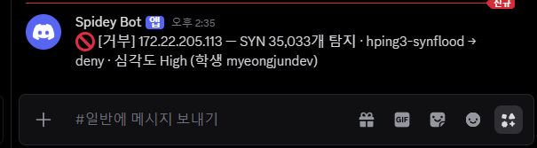

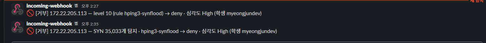

슬랙 화면 위쪽 14:27 알림은 SYN 개수를 문구에 넣기 전의 같은 공격 알림입니다.

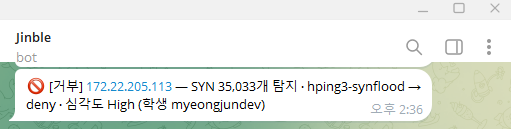

### 5. 게시판 대시보드 저장 결과


### 처음 실행에서 찾아 고친 것

첫 실행(12:34, SYN 505,178건, n8n 실행 179~182)은 흐름이 끝까지 돌았지만 결과가
틀렸습니다. 캡처만 보고 넘기지 않고 n8n 실행 기록과 Graylog 설정을 대조해 네 가지를
고쳤습니다.

| 증상 | 원인 | 고친 것 |
| --- | --- | --- |
| 공격인데 메신저에 `✅ [허용]`으로 표시 (데이터는 `deny`) | n8n `거부인가?` IF 비교값이 `" deny"`로 앞 공백 포함 | 비교값을 `deny`로 |
| 경보의 학생 식별자가 수업 자료의 계정 | Graylog 알림 본문에 학생 식별자가 고정 문자열 | 이벤트 정의에서 GELF의 `student`를 필드로 뽑아 본문에 사용 |
| 경보에 SYN 개수가 없음. 이후 수정본은 IP와 개수까지 고정값 | 이벤트 정의에 필드 추출이 없고 알림 본문이 고정 문자열 | `src_ip`·`syn_count`도 필드로 뽑아 사용, 거부 문구에 SYN 개수 표시 |
| 공격 한 번에 같은 경보가 4번 | Graylog가 15초마다 최근 60초를 다시 검색해 같은 메시지를 4번 잡음 | 알림 유예 5분(`grace_period_ms`) |

유예 때문에 5분 안에 다시 공격하면 이벤트는 쌓여도 알림은 가지 않습니다. 재현할 때는
공격 사이에 5분 이상 간격을 둡니다. Graylog 설정은 Graylog DB에만 있으므로 값을
`docs/MINI-LAB-SYN-FLOOD.md`에 적어 두었습니다.

관련 재현 절차는 `docs/MINI-LAB-SYN-FLOOD.md`, 자리 변경 후 환경 점검 방법은
`docs/RELOCATION-RUNBOOK.md`에 정리했습니다.

---

## 부록 — 저장소 안내

| 경로 | 내용 |
| --- | --- |
| `alert_sender.py` | 경보를 만들어 n8n으로 보내는 전송기 |
| `privilege_revoke_bot.py` | 허용목록 밖 관리자 탐지·GELF 신고·선택적 직접 회수 |
| `controllers/security_controller.py` | 보안 이벤트 REST API |
| `controllers/authz.py` | 등급별 접근 제어 판정 (`api_role_required` · `page_role_required`) |
| `controllers/admin_controller.py` | 회원 관리와 관리자 보안 API, 자기 강등·자기 삭제·마지막 관리자 보호 |
| `templates/dashboard.html` | 보안 대시보드 |
| `graylog/docker-compose.yml` | Graylog · MongoDB · OpenSearch 실습 환경 |
| `wazuh/docker-compose.yml` · `config/` | Wazuh 4.9.0 환경과 Indexer·Dashboard 설정. 인증서는 Git 제외 |
| `generate-indexer-certs.yml` · `config/certs.yml` | 개인 환경의 Wazuh TLS 인증서 생성 구성 |
| `scripts/check_wazuh.ps1` | Agent·Filebeat·Indexer·Docker 네트워크 읽기 전용 점검 |
| `docs/WAZUH-LLM-VERIFICATION-GUIDE.md` | 개인별 LLM 검토 요청문·진단 순서·FIM 테스트·보고서 양식 |
| `scripts/export_graylog_alerts.py` · `graylog/exports/` | Graylog Alerts 내보내기·검토용 JSON·Content Pack |
| `scripts/capture_api_evidence.ps1` | 401·400·201·200을 한 화면에 (증적용) |
| `scripts/capture_db_evidence.ps1` | 저장된 행과 판정별 건수 (증적용) |
| `scripts/capture_role_evidence.py` | 등급별 접근 제어 캡처 (증적용) |
| `scripts/manage_roles.py` | 회원 등급 조회·변경 |
| `scripts/*_alert_task.ps1` | 심화 S4 스케줄러 등록·해제 |
| `scripts/*_privilege_task.ps1` · `run_privilege_bot.ps1` | 권한 회수 봇 스케줄러 등록·해제·실행 |
| `scripts/syn_flood_lab.sh` | SYN Flood 실습 — 2초 공격, 3초 집계, 임계값 넘으면 GELF 경보 |
| `scripts/portcheck2.sh` | 실습망 포트 점검 결과를 n8n 취약점 점검 알림으로 전송 |
| `scripts/*_n8n_*.js` | n8n 워크플로 점검·갱신·실행 확인 |
| `scripts/relocate_environment.ps1` | 자리·PC를 옮긴 뒤 환경 재배치 (`docs/RELOCATION-RUNBOOK.md`) |
| `docs/SUBMISSION-CHECKLIST.md` | 항목별 확인 기록 |
| `tests/` | 자동 테스트 69개 |

두 캡처 스크립트는 API 키와 DB 비밀번호를 **화면에 찍지 않습니다.** `.env`에서 읽어
헤더와 컨테이너 환경변수로만 넘깁니다.

```powershell
.venv\Scripts\python.exe -m unittest discover -s tests    # Ran 69 tests ... OK
```

`pytest`는 `requirements.txt`에 없어 표준 `unittest`로 돌립니다. 파일별로 전송기 4 ·
게시판 5 · 등급별 접근 제어 29 · 권한 회수 봇 2 · 보안 대응 API 5 · 인시던트 대시보드 5 ·
탐지 신호·자기차단 19개입니다. 테스트 설정은 `GELF_ENABLED = False`라 실습 Graylog로
신호를 보내지 않습니다.

## 강사님 최신 보안 대응 코드 통합

강사님 저장소의 계정 잠금, IP 차단, 인시던트 생성, 관리자 과잉권한 탐지·회수 흐름을
이 게시판의 숫자 등급(일반 0, 골드 1, 관리자 2)과 서버 측 JWT 인증에 맞춰 옮겼습니다.
자동화는 `X-API-Key: ADMIN_API_KEY`로 다음 API를 호출할 수 있습니다.

- 계정: `POST /api/admin/lock`, `POST /api/admin/unlock`
- IP: `POST /api/admin/block`, `POST /api/admin/unblock`, `GET /api/admin/blocked`
- 인시던트: `POST /api/admin/incident`, `GET /api/admin/incidents`
- 권한: `GET /api/admin/violations`, `POST /api/admin/grant`, `POST /api/admin/revoke`

### 09-28 강사님 연휴 업데이트 이식

강사님 저장소의 09-24~25 커밋을 이 게시판 구조에 맞춰 옮겼습니다.

**인시던트 티켓 대시보드.** `/dashboard`에 티켓 표를 추가했습니다. 열림·종료 건수, 상태
필터, 열린 티켓의 심각도 분포를 보여 주고, 행을 누르면 자동 취합된 요약이 펼쳐집니다.
조회는 이벤트 조회처럼 키 없이 열고, 생성·종료는 그대로 관리자 API에서만 합니다.

- `GET /api/security/incidents` — `status`(open|closed) · `student` · `limit`(최대 100), 최신순
- `GET /api/security/incidents/summary` — 상태별 건수와 열린 티켓의 심각도 분포

**탐지 신호 4종(GELF).** 지금까지 로그로 남지 않아 탐지 룰을 만들 수 없던 상황을 신고합니다.
`role`은 강사님 룰과 같게 `user`·`gold`·`admin` 영문 값으로 보냅니다. 비밀번호·토큰·시도된
키 값은 어떤 신호에도 넣지 않습니다.

| `_rule` | 보내는 때 | 탐지 시나리오 |
| --- | --- | --- |
| `login-success` | 로그인 성공 | 심야 접속·계정 탈취·한 계정 다중 IP의 토대 |
| `blocked-retry` | 차단된 IP가 다시 요청해 403 | S5 차단 후에도 계속 두드림(지속성) |
| `admin-auth-fail` | 보안 이벤트 API 키가 없거나 틀림, 관리자 API에 틀린 키 | S6 API 키 추측 |
| `gold-access` | 골드 이상이 `/gold`를 엶(403은 제외) | S9 권한 상승 → 실제 열람 상관 탐지 |

강사님 코드와 다른 점: 골드 열람은 `/api/gold/posts`가 아니라 `/gold` 페이지에서 보내고,
관리자 API(`/api/admin/*`)에 틀린 키를 낸 경우도 `admin-auth-fail`로 신고합니다. 관리자
화면은 쿠키로 로그인하고 키를 보내지 않으므로 이 신호에 걸리지 않습니다.

**SOAR 자기차단 수정.** SOAR가 `127.0.0.1`을 차단하면 같은 PC의 경보봇이
`/api/security/events` 기록까지 403을 맞던 문제(강사님 09-24 실측)를 막았습니다.
`SECURITY_API_KEY`나 `ADMIN_API_KEY`가 맞는 요청은 IP 차단을 건너뜁니다. 키 설정이 비어
있으면 아무 요청도 믿지 않고, 틀린 키로는 우회할 수 없습니다.

**테스트 격리.** `.env`의 `GELF_ENABLED=0`이면 GELF를 보내지 않습니다(기본은 켜짐). 테스트
설정은 모두 꺼 두어, 테스트가 실습 Graylog에 가짜 경보를 남기지 않습니다.

로그인 파일 로그는 이후 `controllers/seclog.py`로 이식했습니다. 로그인 성공·실패와
잠긴 계정의 시도를 `logs/security.log`에 기록하고 Wazuh Agent가 수집합니다.
`SECURITY_LOG_PATH`로 저장 위치를 바꿀 수 있으며 Agent의 수집 경로도 같은 위치로 맞춥니다.

권한 회수 봇은 먼저 출력만 확인한 뒤 실제 연동을 켜는 순서가 안전합니다.

```powershell
python privilege_revoke_bot.py --dry-run
python privilege_revoke_bot.py
python privilege_revoke_bot.py --revoke
```

### 10-06 Gobuster 404 스캔 탐지 연결 복구

`app.py`의 응답 후 처리에서 404 응답을 GELF UDP로 전송합니다. Graylog에서는
`rule:web-scan`으로 검색하며, 메시지에 `src_ip`, `path`, `code=404`가 들어갑니다.
요청의 쿼리 문자열은 기록하지 않습니다. 관리자 대응 API(`/api/admin*`)의 404는
집계에서 제외하며, 이미 차단된 IP의 403은 기존 `blocked-retry`로 기록합니다.
GELF 전송 장애가 나더라도 원래 HTTP 응답은 유지합니다.

현재 로컬 Graylog의 웹 스캐너 탐지 규칙은 활성화되어 있고, 모든 Stream에서
`rule:web-scan`을 검색해 `src_ip`별로 집계합니다. 조건은 **30초 안에 30회 초과**이며,
실행 주기는 30초입니다. 따라서 404 로그 한 건은 Search에서 보이지만 이 조건의
이벤트를 만들지는 않습니다. 설정을 변경했다면 실제 Event Definition 값을 확인하세요.

실습 터미널에서 `GW`가 게시판 호스트를 가리키는지 확인한 뒤 실행합니다.

```bash
gobuster dir -u "http://$GW:5000" -w /usr/share/wordlists/dirb/common.txt -t 30
```

`-q`를 빼면 진행 상황을 확인하기 쉽습니다. `/admin`과 `/gold`의 401은 로그인 정보가
없어 접근이 거절된 결과이며, 스캔 탐지는 Gobuster 결과에 표시되지 않는 404 요청을
집계합니다. 임의 경로부터 403이 나오면 IP 차단 상태를 먼저 확인하세요.

2026-10-06 검증: 자동 테스트 69개 통과. 실행 중인 게시판에 진단용 404 요청 한 건을
보내 Graylog Search에서 동일 경로의 `web-scan` 메시지 수신을 확인했습니다.

이어 수업 중 실행한 스캔의 로그를 Graylog API로 확인했습니다. 아래 시각은 한국 시각입니다.

| 시각 | 확인 결과 |
| --- | --- |
| 14:48:05 | 웹 스캔 탐지 이벤트 생성 — 출발지 IP별 404 562건 집계 |
| 14:48:35 | 웹 스캔 탐지 이벤트 생성 — 출발지 IP별 404 1,102건 집계 |
| 14:48:46~14:49:53 | Nikto 실행 시간대 — `blocked-retry` 7,975건, `web-scan` 0건 |

Nikto 실행 때는 출발지 IP가 이미 차단되어 403을 반환했습니다. 이 요청은
`blocked-retry`로 기록되므로 `rule:web-scan` 조건으로 새 이벤트를 만들지 않습니다.
Search와 Alerts & Events의 조회 시간에 스캔 시각이 포함되어야 결과가 보입니다.
연결된 메신저 알림의 실제 전달 여부는 이번 확인에 포함하지 않았습니다.

Nikto의 보안 헤더 경고는 스캔 진단 결과이며, 해당 출력 문구를 Graylog로 전송하는
기능은 없습니다. 스캔 완료 후 새 서버 버전 정보를 개발팀에 제출할지 묻는 질문을
생략하고 제출도 하지 않으려면 다음 옵션을 사용합니다.

```bash
nikto -h "http://${GW}:5000/" -ask no
```

`GW`와 `gw`는 서로 다른 변수입니다. `X-Content-Type-Options` 누락과 CSP
`frame-ancestors` 관련 헤더 경고는 이번 탐지 연결 수정에서 변경하지 않았습니다.
