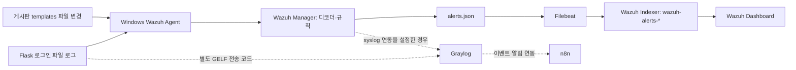

# Wazuh Dashboard 메시지 미표시 — 개인별 LLM 검토·검증 길라잡이

작성일: 2026-10-08 · 수업 기준: Wazuh 4.9.0 · 환경: Windows / PowerShell / Docker Desktop / Windows Agent

이 문서는 각자가 자신의 PC에서 LLM과 함께 Wazuh 수집 상태를 확인하기 위한 자료입니다.
정상 동작한 다른 사람의 화면은 비교 자료이고, 본인 PC의 정상 동작 증거는 본인 PC에서 수집해야 합니다.
목표는 **동일한 테스트 사건이 Manager → Indexer → Dashboard에 모두 존재하는지 확인**하는 것입니다.

## 1. 시작 방법 — LLM에 전달할 요청

이 Markdown을 LLM에 첨부하거나 프로젝트 폴더에 두고 다음 요청을 전달합니다.

```text
첨부한 Wazuh 검증 길라잡이를 기준으로 내 PC를 검토해 줘.

현재 증상은 Wazuh Dashboard에 기대한 메시지가 보이지 않는 것이다.
먼저 컨테이너 이름, Compose 위치, 게시판 경로, Agent ID, Docker 네트워크를 확인해 줘.
다른 사람의 C:\SKT aleph 경로나 Agent 001을 내 환경에 그대로 적용하지 마.

Agent → Manager 경보 생성 → Filebeat 실제 전송 → Indexer 저장 → Dashboard 표시 순서로
읽기 전용 점검을 수행하고, 가장 먼저 확인되지 않는 구간을 찾아 줘.
확인한 사실, 가능한 원인, 아직 확인하지 못한 내용을 구분해 줘.
같은 테스트 사건의 시간·Agent·규칙·파일 경로를 비교해 줘.

수정이 필요하면 근거와 변경 범위를 설명하고, 내가 요청한 작업 범위 안에서 진행해 줘.
기존 Agent 등록·규칙·그룹·볼륨을 보존하고, 변경 후 같은 검증을 다시 수행해 줘.
비밀번호, 개인키, API 토큰, client.keys 원문은 출력하거나 공유하지 마.
최종 결과는 이 문서의 검증 보고서 양식으로 작성해 줘.

터미널이나 파일을 직접 사용할 수 없다면 필요한 명령을 단계별로 알려 줘.
내가 전달하지 않은 실행 결과를 추정해서 정상이라고 판정하지 마.
```

첫 점검에서는 컨테이너나 볼륨을 삭제·재생성하지 않습니다. 특히 `docker compose down -v`,
볼륨 삭제, Agent 재등록은 이 진단의 기본 절차가 아닙니다. 실제로 필요한 수정은 원인 확인과
기존 데이터 백업 후 수행합니다. TLS 검증을 끄거나 인증을 없애는 방식으로 문제를 덮지 않습니다.

## 2. 메시지가 이동하는 경로



Graylog의 Flask 직접 전송 메시지나 n8n의 성공 실행만으로 Wazuh 수집 상태를 판정할 수 없습니다.
로그인 파일 수집과 FIM 파일 감시도 별도로 점검합니다. Windows 로그인 경보가 있다는 사실만으로
Flask 로그인 파일 수집까지 정상이라고 판단하지 않습니다.

각자의 Docker에서 `9_graylog_default`라는 이름을 사용해도 PC 간 네트워크가 연결되는 것은 아닙니다.
`localhost`는 접속하는 PC 자신입니다. Agent와 Manager가 서로 다른 PC라면 Manager 주소와 접속 대상을
그 구성에 맞춰 확인해야 합니다.

## 3. 정상 동작 PC의 참고값과 개인 환경 기록

다음은 2026-10-08 실제 점검한 `flask-board` PC의 참고값입니다. 다른 사람에게 그대로 복사할 값은 아닙니다.

| 항목 | 참고 PC에서 확인한 값 | 본인 PC의 확인값 |
|---|---|---|
| Wazuh 버전 | Manager·Indexer·Dashboard 모두 4.9.0 | |
| 컨테이너 | `wazuh-manager`, `wazuh-indexer`, `wazuh-dashboard` | |
| 게시판 경로 | `C:\SKT aleph\flask-board` | |
| Wazuh Compose | 게시판 아래 `wazuh\docker-compose.yml` | |
| 설정·인증서 경로 | 게시판 루트 `config\` | |
| Compose의 파일 마운트 | `../config/...` | |
| 외부 Docker 네트워크 | `9_graylog_default` | |
| Windows Agent | `board-host`, ID `001`, Active | |
| Agent 그룹 | `default, flask-board` | |
| 파일 로그 | 게시판의 `logs\security.log` | |
| FIM 감시 경로 | 게시판의 `templates\` | |
| Dashboard | Docker 호스트의 `https://localhost/`, 호스트 포트 443 | |

참고 PC에서는 로그인 실패 `100210`, 브루트포스 의심 `100211`, FIM 생성·수정 `100220`,
삭제 `100222`가 Indexer에서 조회됐습니다. 한 점검 시점의 Agent 001 경보 수는 86건이었습니다.
**86건은 참고 시점의 관측값이며 개인별 통과 기준이나 고정된 기대값이 아닙니다.**

## 4. 빠른 점검 — 함께 전달할 PowerShell 스크립트

이 문서와 함께 제공하는 [`check_wazuh.ps1`](../scripts/check_wazuh.ps1)을 사용하면 기본 증거를 수집할 수 있습니다.
스크립트는 본인 PC의 컨테이너, Agent, Manager 최근 경보, Filebeat, Indexer 건수, 네트워크를 읽습니다.
Indexer 계정은 로컬 Manager 환경변수에서 읽고 출력하지 않습니다.

저장한 폴더에서 실행:

```powershell
powershell -NoProfile -ExecutionPolicy Bypass -File .\check_wazuh.ps1
```

먼저 출력된 Agent 목록에서 실제 ID를 확인합니다. 본인 ID가 `002`인 경우에만 다음처럼 다시 실행합니다.

```powershell
powershell -NoProfile -ExecutionPolicy Bypass -File .\check_wazuh.ps1 -AgentId 002
```

`ExecutionPolicy Bypass`는 이 PowerShell 프로세스에만 적용하며 시스템 정책을 변경하지 않습니다.
스크립트의 종료 코드나 마지막 문구만 보지 말고 **각 단계의 출력과 오류를 개별적으로 검토**합니다.
최근 경보 5건은 과거 사건일 수도 있고, 전체 경보 건수에는 다른 Agent 경보가 포함될 수도 있습니다.

스크립트가 없어도 아래 순서의 명령으로 진단할 수 있습니다. 예시 컨테이너 이름이 실제 환경과 다르면
실제 이름으로 바꿉니다. 이전 단계가 실패하면 그 실패를 기록하고 원인을 확인합니다.

## 5. 단계별 진단

### A. 컨테이너와 실행 대상을 확인

```powershell
Get-Location
docker ps -a --format '{{.Names}} | {{.Image}} | {{.Status}} | {{.Ports}}'
docker images --filter reference='wazuh/*'
docker inspect wazuh-manager --format '{{index .Config.Labels "com.docker.compose.project.config_files"}}'
```

세 서비스가 실행 중인지, 재시작을 반복하지 않는지, Dashboard의 호스트 포트가 실제로 443인지 확인합니다.
이미지 다운로드 중이라 아직 컨테이너가 없다면 **기동 준비 미완료**로 기록합니다.
`Up`만으로 로그인이나 데이터 수집까지 통과한 것은 아닙니다.

확인한 Wazuh Compose 파일을 지정해 구문을 검사합니다.

```powershell
# 본인의 실제 파일 경로로 바꿉니다. 아래는 참고 PC의 예입니다.
$ComposeFile = 'C:\SKT aleph\flask-board\wazuh\docker-compose.yml'
docker compose -f $ComposeFile config --quiet
```

게시판 루트의 Compose가 MySQL만 정의할 수도 있으므로 Wazuh 파일을 정확히 지정합니다.
Compose 구문 검사가 성공해도 인증서 파일의 존재나 서비스 정상 동작은 별도로 확인해야 합니다.

### B. 실제 Docker 네트워크와 파일 마운트 확인

```powershell
docker network ls
docker network inspect 9_graylog_default --format '{{.Name}} {{range .Containers}}{{.Name}} {{end}}'
docker inspect wazuh-manager wazuh-indexer wazuh-dashboard --format '{{.Name}} {{range $key, $value := .NetworkSettings.Networks}}{{$key}} {{end}}'
docker inspect wazuh-manager wazuh-indexer wazuh-dashboard --format '{{.Name}} {{json .Mounts}}'
```

수업 구성에서는 세 Wazuh 서비스가 모두 `9_graylog_default`에 연결되고,
`wazuh.manager`, `wazuh.indexer`, `wazuh.dashboard` 별칭으로 통신합니다.
이름만 같은 빈 네트워크가 따로 생성된 상태인지도 확인합니다.

호스트의 실제 파일 위치와 Compose 상대 경로를 비교합니다.
`wazuh/docker-compose.yml`에서 `./config/`는 `wazuh/config/`를 가리킵니다.
게시판 루트의 `config/`를 사용하려면 이 배치에서는 `../config/`가 필요합니다.
파일을 다른 위치에 둔 팀원은 자신의 배치에 맞춰 계산합니다.
인증서 파일 대신 디렉터리가 마운트됐는지도 확인합니다.

### C. Agent가 연결되고 원하는 그룹 설정을 받았는지 확인

```powershell
docker exec wazuh-manager /var/ossec/bin/agent_control -l
Get-Service -Name WazuhSvc
```

Manager 자체의 ID `000`만 Active인 것으로 통과 처리하지 않습니다.
수집할 Windows Agent가 목록에 존재하고 Active인지 확인합니다.

```powershell
# 앞 단계에서 본인의 실제 ID를 확인한 후 지정합니다.
$AgentId = '002'
docker exec wazuh-manager /var/ossec/bin/agent_groups -s -i $AgentId
docker exec wazuh-manager cat /var/ossec/etc/shared/flask-board/agent.conf
```

위 그룹 경로도 수업 예시입니다. 실제 사용하는 그룹이 다르면 해당 그룹을 확인합니다.
Windows Agent에 전달된 공유 설정도 확인합니다.

```powershell
$AgentSharedConfig = 'C:\Program Files (x86)\ossec-agent\shared\agent.conf'
Select-String -LiteralPath $AgentSharedConfig -Pattern '<location>','<directories','<log_format>'
```

설치 위치가 다르면 실제 파일 위치를 사용합니다. 로컬 `ossec.conf`뿐 아니라 전달받은 공유 설정을
함께 확인해야 합니다. 다른 사람의 `E:\...\_7_board_test` 경로가 남아 있지 않은지 점검합니다.

### D. 로그인 파일 로그 또는 FIM 사건이 생성되는지 확인

먼저 확인된 게시판 루트를 지정합니다. 아래는 참고 경로입니다.

```powershell
$BoardRoot = 'C:\SKT aleph\flask-board'
Get-Item -LiteralPath (Join-Path $BoardRoot 'logs\security.log')
```

로그인 검증에서는 테스트 로그인 시각을 기록하고 해당 파일이 갱신되는지 확인합니다.
Flask가 실행되는 프로젝트, `SECURITY_LOG_PATH`, Agent의 `<location>`이 같은 파일을 가리켜야 합니다.
파일이 생기지 않으면 게시판의 파일 기록 코드·활성 설정부터 확인합니다.
이 단계에서 실제 사용자의 비밀번호를 반복 입력하거나 임의 계정에 공격을 수행하지 않습니다.

FIM 검증에서는 `<directories realtime="yes" ...>`가 **본인의 `templates` 폴더**를 가리키는지
확인합니다. 커스텀 규칙의 경로 정규식도 현재 폴더 이름과 일치해야 합니다.

```powershell
docker exec wazuh-manager cat /var/ossec/etc/rules/local_rules.xml
docker exec wazuh-manager cat /var/ossec/etc/decoders/local_decoder.xml
```

수업의 `100210`~`100222`는 커스텀 규칙입니다. 각 PC에 실제로 설치돼 있는지 확인합니다.
규칙 파일이 없거나 ID가 다르면 같은 번호가 반드시 나올 것이라고 가정하지 않습니다.

### E. Manager가 해당 사건의 경보를 만들었는지 확인

```powershell
docker exec wazuh-manager /var/ossec/bin/wazuh-control status
docker exec wazuh-manager tail -n 20 /var/ossec/logs/alerts/alerts.json
```

테스트 시각에 해당하는 `timestamp`, `agent.id`, `rule.id`, 파일 사건이면 `syscheck.path`와
`syscheck.event`를 확인합니다. `alerts.json`은 탐지 규칙을 통과한 경보 파일이므로,
모든 원본 로그가 여기에 기록되는 것은 아닙니다.
원본 파일에 로그가 있지만 경보가 없다면 수집·디코더·규칙·경보 임계값을 나누어 확인합니다.

브루트포스 규칙의 예에서는 동일 IP의 반복 실패 조건과 시간 창이 있습니다.
정확한 조건은 해당 PC의 `local_rules.xml`에서 확인합니다. 단일 실패만으로 상관 경보가
발생할 것이라고 가정하지 않습니다.

최근 20건에 사건이 없다는 사실만으로 미수신이라고 단정하지 않습니다.
로그가 많다면 테스트 파일명이나 식별자를 사용해 더 넓은 범위를 검색합니다.
원문에는 사용자·IP·파일 권한 정보가 포함될 수 있으므로 공유할 때 필요한 필드만 남깁니다.

### F. Filebeat 연결 테스트와 실제 실행 로그를 함께 확인

```powershell
docker exec wazuh-manager filebeat test output -c /etc/filebeat/filebeat.yml
docker logs --since 10m wazuh-manager 2>&1 |
    Select-String -Pattern '401|Unauthorized|Failed to connect|DNS lookup failure|publisher_pipeline_output' |
    Select-Object -Last 20
```

정상 연결 테스트는 마지막에 `talk to server... OK`가 나옵니다.
테스트가 성공해도 실제 프로세스의 전송 오류와 Indexer 저장 여부를 추가로 확인합니다.
예전 오류 한 줄을 현재 실패라고 판단하지 말고 시각과 반복 여부를 비교합니다.

| 관측한 오류 | 우선 확인할 대상 |
|---|---|
| `no such host`, DNS 실패 | Indexer 존재, 공통 네트워크, 서비스 별칭 |
| `connection refused` | Indexer 기동·초기화·재시작 상태 |
| 인증서 검증 오류 | CA, 서비스 인증서, DNS 이름, 경로, 권한 |
| `401 Unauthorized` | 실제 계정 값, 값 내부의 따옴표, 실제 Filebeat 설정·프로세스 |
| 테스트 OK지만 사건이 없음 | 실행 중 전송, 입력 파일, registry, Indexer의 해당 사건 조회 |

Compose의 배열식 환경변수는 `- INDEXER_USERNAME=admin`처럼 사용합니다.
`- INDEXER_USERNAME="admin"`은 값에 따옴표가 들어갈 수 있습니다.
기존 `filebeat_etc`에 오래된 설정이 남았는지도 조사하되, 확인 없이 볼륨을 지우지 않습니다.
`filebeat_var`에는 읽은 위치가 저장되므로 삭제하면 과거 경보의 중복 전송이 생길 수 있습니다.

### G. Indexer에 실제 경보가 저장되는지 확인

가장 간단한 방법은 진단 스크립트를 실제 Agent ID로 실행하고 `[5]`의 JSON을 확인하는 것입니다.
`count`가 양수인 것과 오류 응답을 구분합니다. 해당 Agent 건수가 양수여도 새 테스트 사건이
저장됐다는 증거는 아니므로, 시간·규칙·파일 경로까지 일치하는 사건을 찾아야 합니다.

스크립트를 사용할 수 없다면 다음 블록은 계정을 출력하지 않고 로컬 환경변수에서 읽어 조회합니다.
실제 컨테이너 이름이나 CA 경로가 다르면 먼저 맞춥니다. 이 블록에서는 이미 확인한 `$AgentId`를 사용합니다.

```powershell
$WazuhValues = @{}
$WazuhEnvItems = docker inspect wazuh-manager --format '{{json .Config.Env}}' | ConvertFrom-Json
foreach ($WazuhItem in $WazuhEnvItems) {
    $WazuhPair = $WazuhItem -split '=', 2
    if ($WazuhPair.Count -eq 2) { $WazuhValues[$WazuhPair[0]] = $WazuhPair[1] }
}
if (-not $WazuhValues['INDEXER_USERNAME'] -or -not $WazuhValues['INDEXER_PASSWORD']) {
    throw 'Manager 환경변수에서 Indexer 계정을 확인할 수 없습니다. 로컬 설정을 확인하세요.'
}
$WazuhAuth = ($WazuhValues['INDEXER_USERNAME'] + ':' + $WazuhValues['INDEXER_PASSWORD']).Replace('\', '\\').Replace('"', '\"')
if ($WazuhAuth.Contains("`r") -or $WazuhAuth.Contains("`n")) { throw '계정 값 형식을 확인하세요.' }
$WazuhCurlConfig = 'user = "' + $WazuhAuth + '"'
$WazuhQuery = [Uri]::EscapeDataString('agent.id:' + $AgentId)
$WazuhUrl = 'https://wazuh.indexer:9200/wazuh-alerts-*/_count?q=' + $WazuhQuery
$WazuhCurlConfig | docker exec -i wazuh-indexer curl --silent --show-error --max-time 15 --cacert /usr/share/wazuh-indexer/certs/root-ca.pem --config - $WazuhUrl
```

같은 접속 방식으로 `_search`를 사용해 테스트의 규칙·경로·시각을 확인합니다.
아래는 실제 `$AgentId`와 `100220`으로 범위를 좁히는 FIM 검색 예입니다.

```powershell
$WazuhQuery = [Uri]::EscapeDataString('agent.id:' + $AgentId + ' AND rule.id:100220')
$WazuhUrl = 'https://wazuh.indexer:9200/wazuh-alerts-*/_search?size=5&sort=timestamp:desc&filter_path=hits.hits._source.timestamp,hits.hits._source.agent.id,hits.hits._source.rule.id,hits.hits._source.syscheck.path,hits.hits._source.syscheck.event&q=' + $WazuhQuery
$WazuhCurlConfig | docker exec -i wazuh-indexer curl --silent --show-error --max-time 15 --cacert /usr/share/wazuh-indexer/certs/root-ca.pem --config - $WazuhUrl
```

로그인 검증에서는 실제 규칙 ID로 바꿉니다. 전체 건수만으로 새 사건의 저장 여부를 판단하지 않습니다.
접속에 사용하는 CA를 확인할 수 없다면 그 항목을 미확인으로 기록하고 원인을 조사합니다.

### H. Dashboard 표시 조건 확인

1. Docker 호스트의 Wazuh Dashboard에 로그인합니다. Flask의 `/dashboard`, Graylog의 9000번과 구분합니다.
2. 본인의 Agent를 선택합니다. 다른 PC의 `001`이나 자료의 `002`를 고정하지 않습니다.
3. 시간 범위를 먼저 **Last 1 hour**, 과거 검증이라면 **Last 24 hours** 또는 테스트 시각을 포함하는 절대 범위로 정합니다.
4. 이전 검색과 저장된 필터를 확인하고, Agent만 선택해서 다시 검색합니다.
5. Threat Hunting에서 대상 사건을 찾습니다. FIM은 File Integrity에서도 확인합니다.
6. `agent.id`, `rule.id`, 표시 시각, 파일 경로를 Indexer의 동일 사건과 비교합니다.

`alerts.json`의 UTC 표기 `+0000`과 한국 시각 `+0900`은 9시간 차이입니다.
예를 들어 `03:09:49 +0000`은 같은 날 `12:09:49` KST입니다.
컨테이너의 `TZ=Asia/Seoul`과 내부 사건의 UTC 저장을 혼동하지 않습니다.

Indexer에 새 대상 사건이 있는데 화면에서 찾지 못할 때 Dashboard 검색 조건·시각·접속 대상·
대상 인덱스를 조사합니다. Indexer에 사건이 없는 단계에서는 Dashboard 표시만 바꿔도
앞 단계의 문제는 해결되지 않습니다.

## 6. 최종 확인용 무해한 FIM 테스트

이 단계에서는 파일을 생성합니다. 본인의 로컬 실습 환경에서 FIM 테스트를 진행할 때 사용합니다.
파일 내용은 실행 코드가 없는 문자열입니다. 연결된 Graylog·n8n에도 테스트 경보가 전달될 수 있습니다.
기존 `test.php`나 `attack.php`를 덮어쓰지 않고 고유 이름을 사용합니다.

앞 단계에서 확인한 `$BoardRoot`를 사용합니다.

```powershell
$FimName = 'llm_fim_check_' + (Get-Date -Format 'yyyyMMdd_HHmmss') + '.php'
$FimPath = Join-Path (Join-Path $BoardRoot 'templates') $FimName
if (Test-Path -LiteralPath $FimPath) { throw '기존 파일을 덮어쓰지 않습니다.' }
$FimStartedAt = Get-Date
Set-Content -LiteralPath $FimPath -Value 'Harmless FIM test; no executable code.'
$FimName
$FimStartedAt
```

생성 사건을 Manager와 Indexer에서 확인한 뒤 수정합니다.

```powershell
Add-Content -LiteralPath $FimPath -Value 'Harmless modification.'
```

수정 사건을 확인한 뒤 **방금 만든 고유 파일만** 삭제합니다.

```powershell
Remove-Item -LiteralPath $FimPath
Test-Path -LiteralPath $FimPath
```

마지막 `Test-Path`는 `False`가 정상입니다. 사건을 확인하기 전에 세 작업을 연달아 실행하지 않고,
단계별 생성·수정·삭제 사건을 구분합니다. 지연이 있으면 잠시 기다려 재확인하고, 짧은 대기 시간만으로
동작하지 않는다고 단정하지 않습니다.

| 사건 | 수업 커스텀 규칙이 설치된 경우의 기대값 | 필요한 증거 |
|---|---|---|
| `.php` 생성 | `100220` | 동일 Agent, 고유 이름, `added`, 테스트 시각 |
| `.php` 수정 | `100220` | 동일 Agent, 고유 이름, `modified`, 테스트 시각 |
| `.php` 삭제 | `100222` | 동일 Agent, 고유 이름, `deleted`, 테스트 시각 |

규칙이 다르면 실제 설정으로 기대값을 정합니다. 표준 FIM 사건만 있고 커스텀 규칙이 나오지 않으면
FIM 수집과 커스텀 규칙 일치를 구분해 진단합니다. 이 FIM 테스트만으로 Flask 로그인 수집까지 통과했다고 판정하지 않습니다.

## 7. 자주 발견한 차이와 수정 방향

| 차이·관측 | 확인할 내용과 수정 방향 |
|---|---|
| 다른 PC의 Agent ID로 검색 | 본인 Agent 목록에서 ID를 다시 확인 |
| 파일 로그에 다른 사람의 경로 | 실제 Flask 로그 경로와 Agent 수집 경로를 맞춤 |
| FIM 규칙에 `_7_board_test`가 남음 | 실제 감시 폴더와 규칙의 정규식 비교 |
| `config/`를 다른 계층에 생성 | Compose 기준 상대 경로와 실제 파일 위치를 맞춤 |
| Manager 설정 볼륨 미사용 | 컨테이너 안 실제 데이터를 검증하며 백업한 뒤 이전 |
| etc 백업이 비어 있음 | tar 안 Agent 키·규칙·공유 설정 확인. 빈 백업을 복원용으로 쓰지 않음 |
| Manager에 사건이 있고 Indexer에는 없음 | Filebeat 실행 로그·입력 파일·출력 대상·인증 확인 |
| Indexer에 사건이 있고 화면에는 없음 | 시간 범위·Agent·필터·Dashboard 접속 대상 확인 |

정상 PC의 Compose에 있는 `external: true` 데이터 볼륨은 그 PC에서 이전한 것입니다.
다른 PC에 Compose만 복사해도 원본 데이터는 이동하지 않습니다. 실제 볼륨 이름·마운트 대상·백업을
확인한 뒤 적용합니다. 기존 등록을 지우고 새로 만드는 것을 첫 대응으로 삼지 않습니다.

## 8. LLM이 작성할 검증 보고서

아래 양식을 복제해 작성합니다. 실행하거나 결과를 받지 않은 항목은 `미확인`, 검증 조건이
갖춰지지 않은 항목은 `검증 불가`로 기록하고 정상으로 처리하지 않습니다.

```markdown
# Wazuh 개인 검증 결과

- 검증 날짜·시각·타임존:
- 본인 PC / 대상 Docker 호스트:
- 원래 증상:
- 기대한 사건: 로그인 / FIM / 기타
- 실제 Compose·게시판 경로:
- Agent 이름·ID·그룹:
- 테스트 식별자·생성 시각:

| 단계 | 판정: 정상 / 이상 / 미확인 / 검증 불가 | 근거: 명령·출력·시각 |
|---|---|---|
| 컨테이너·네트워크·파일 마운트 | | |
| Agent 연결·공유 설정 | | |
| 원본 로그 / FIM 사건 생성 | | |
| Manager 대상 사건 | | |
| Filebeat 연결·실제 전송 | | |
| Indexer의 동일 대상 사건 | | |
| Dashboard의 동일 대상 사건 | | |

## 확인한 원인
- 처음 끊긴 구간:
- 원인을 뒷받침하는 증거:
- 가설·미확인 사항:

## 수정과 재검증
- 변경 파일·설정:
- 저장한 백업과 내용 확인:
- 재검증 명령과 결과:
- 테스트 파일 정리 여부:
- 남은 작업:
```

전체 경로의 정상 여부는 동일 사건이 Dashboard에 표시되는 것까지 확인한 뒤 판정합니다.
Indexer까지 확인하고 화면을 보지 않았다면 `Indexer까지 정상, Dashboard 미확인`입니다.

## 9. 공유할 증거의 범위

이 MD, 진단 스크립트 출력, 테스트 시각·Agent ID·규칙 ID·필요한 경로, Dashboard 표시 조건을 공유합니다.
공유할 때 불필요한 사용자 이름·IP는 가리되, 원인 판단에 필요한 시각과 사건 식별자는 유지합니다.
`.env` 전체, TLS의 `*-key.pem`·`*.key`, API 토큰, `client.keys` 전체, 비밀 정보가 담긴 백업은
LLM 첨부나 Git 커밋 대상에 넣지 않습니다. 로컬에서 존재와 설정 일치를 확인하고 비밀 값 자체는 옮기지 않습니다.

## 10. 참고 자료

설정 파일은 수업 버전 **v4.9.0**에 맞춰 확인합니다. 공식 문서의 `current`에는 새로운 버전의 예시가
포함될 수 있으므로 명령이나 설정을 무조건 바꾸지 않습니다.

- [수업 노트: Wazuh 4.9 Dashboard 추가 설정](https://app.notion.com/p/wazuh_4-9_-d730741730ea82ed95b881c8f214105f)
- [공식 Wazuh Docker v4.9.0 구성](https://github.com/wazuh/wazuh-docker/blob/v4.9.0/single-node/docker-compose.yml)
- [공식 Docker 설치 절차](https://documentation.wazuh.com/current/deployment-options/docker/wazuh-container.html)
- [공식 로그 수집 구조](https://documentation.wazuh.com/current/user-manual/capabilities/log-data-collection/how-it-works.html)
- [공식 FIM 기본 설정](https://documentation.wazuh.com/current/user-manual/capabilities/file-integrity/basic-settings.html)
